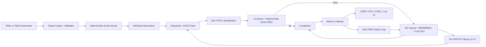
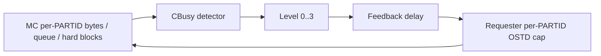

# SoC Flow Control / MPAM Simulator
# Current Architecture and Implementation Specification

## 0. Document Control

| Item | Value |
| --- | --- |
| Document status | Current implementation baseline |
| Baseline commit | `85721e3` |
| Baseline date | 2026-06-21 |
| Primary implementation | Python deterministic discrete-event simulation |
| Interactive UI | Local HTML/CSS/JavaScript console served by Python |
| Main scope | SoC flow control, L3/SLC contention, MC bandwidth/QoS, MPAM-style PARTID/PMG monitoring |
| Explicitly excluded | Cache coherency, CPU pipeline timing, detailed DRAM timing, full Arm MPAM register model |

This document describes what the current code actually does. It is intended
to be edited as the authoritative input for the next implementation change.

Normative words:

- **SHALL**: required behavior of the current baseline or requested future revision.
- **SHOULD**: recommended behavior that is not yet mandatory.
- **MAY**: optional behavior or extension point.

Implementation labels:

- **IMPLEMENTED**: directly implemented and covered by code.
- **APPROXIMATE**: implemented as a system-level behavioral approximation.
- **RESERVED**: configuration or interface exists, but behavior is not implemented.
- **OUT OF SCOPE**: intentionally excluded from the current model.
- **KNOWN GAP**: current implementation differs from the desired or documented behavior.

This specification supersedes older project text where that text still refers
to L3 CMIN/CMAX as way counts or to one shared priority value for both NoC and
memory-controller arbitration.

---

## 1. System Objective

### SYS-OBJ-001: Primary objective

The simulator SHALL evaluate causal SoC flow-control behavior:

1. how request injection creates contention;
2. where queues and backpressure accumulate;
3. how L3 allocation controls affect occupancy and hit probability;
4. how MC bandwidth and QoS controls affect service order;
5. how downstream congestion feeds back to requester OSTD;
6. how controls affect throughput, tail latency, fairness, and queue pressure.

### SYS-OBJ-002: Fidelity level

The model is a system-architecture exploration model. It is:

- not RTL;
- not cycle accurate;
- not a CPU microarchitecture model;
- not a coherent cache model;
- not a JEDEC DRAM command/timing model;
- not a full Arm MPAM architectural register emulator;
- not a Linux `resctrl`, ACPI, firmware, or hypervisor model.

### SYS-OBJ-003: Evidence boundary

Results SHALL be interpreted as model evidence for mechanism directionality
and control-loop behavior. Numerical correlation to silicon requires external
calibration of:

- queue depths;
- service parallelism;
- latency constants;
- traffic distributions;
- cache hit model;
- bandwidth windows;
- CBusy thresholds;
- software control periods.

---

## 2. Overall Architecture



### SYS-ARCH-001: Component ownership

| Component | Responsibility | Implementation |
| --- | --- | --- |
| Config loader | YAML to typed dataclasses | `src/config/loader.py` |
| Config validator | Topology and control constraints | `src/config/validator.py` |
| Event kernel | Time-ordered deterministic callbacks | `src/sim/kernel.py` |
| Workload generator | Address, operation, and injection timing | `src/traffic/generator.py` |
| Requester runtime | Global/per-PARTID OSTD and source backpressure | `src/traffic/requester.py` |
| NoC fabric | One abstract bottleneck queue and link | `src/noc/fabric.py` |
| Cache MSC | L3 queue, hit probability, sampled ownership | `src/cache/cache_msc.py` |
| MC MSC | Queue, token state, QoS scheduler, CBusy | `src/ddr/memctrl.py` |
| Settings table | Per-MSC, per-PARTID control state | `src/mpam/settings.py` |
| Slow policy | P99-driven MC QoS/BMAX update | `src/scheduler/closed_loop.py` |
| Metrics collector | Interval/cumulative metrics and traces | `src/monitor/collector.py` |
| Web server | Background jobs, experiments, verification | `src/web/server.py` |
| Web client | Configuration and live visualization | `src/web/static/` |

### SYS-ARCH-002: Request path

A request follows exactly one path:

```text
workload generator
  -> requester OSTD admission
  -> NoC
  -> requester-selected L3
  -> completion on modeled L3 hit
  -> address-selected MC on modeled L3 miss
  -> completion
```

The model has no retry from MC to L3, no coherence traffic, no snoop path, and
no writeback/eviction request path.

---

## 3. Simulation Kernel

### SIM-KERNEL-001: Event ordering

Events are ordered by:

```text
(event_time_ns, monotonically_increasing_sequence)
```

Events scheduled at the same time execute in creation order.

### SIM-KERNEL-002: Determinism

For identical:

- validated configuration;
- seed;
- Python/runtime behavior;
- event insertion order;

the simulation SHALL produce identical metrics.

Each stochastic component uses an independent deterministic seed offset:

- each cache: `simulation.seed + 100 + cache_index`;
- each workload/requester generator: `simulation.seed + 1000 + generator_index`.

### SIM-KERNEL-003: Time unit

The internal time unit is floating-point nanoseconds.

### SIM-KERNEL-004: Run termination

The kernel executes all events with:

```text
event.time_ns <= simulation_end_ns
```

Pending requests may remain incomplete at simulation end. Therefore:

```text
completion_ratio = completed_requests / issued_requests
```

may be below one.

### SIM-KERNEL-005: Control sampling

Monitor capture and slow control are scheduled every:

```text
simulation.control_interval_ns
```

The final interval is captured at simulation end if the end time is not an
exact control-period boundary.

---

## 4. Configuration Model

### CFG-001: Generic YAML interface

The generic YAML/Python model supports configurable:

- clusters and cores;
- threads per core;
- requester attachment nodes;
- explicit non-CPU requesters;
- L3 instances and sharing;
- NoC size and abstract link parameters;
- MC instances and aggregate channel bandwidth;
- PARTID/PMG definitions;
- per-MSC controls;
- workloads and policies.

### CFG-002: Interactive reference boundary

The current web console intentionally fixes:

```text
8 cores
2 hardware threads per core
16 requester rows
16 PARTID rows
PARTID 0..15
PMG 0..15 in the web editor
```

The generic YAML model is not restricted to the same core count, but the web
builder currently validates `active_cores == 8` and `threads_per_core == 2`.

### CFG-003: Main typed configuration

| Area | Key fields |
| --- | --- |
| Simulation | `time_ns`, `seed`, `control_interval_ns` |
| Cluster | `id`, `cores`, `l3` |
| L3 | `size_bytes`, `sets`, `ways`, `line_size`, `hit_latency_ns`, `queue_depth`, `lookup_parallelism` |
| NoC | `routers`, `link_bandwidth_gbps`, `router_latency_ns`, `queue_depth`, `virtual_channels`, `average_hops` |
| MC | channels, bandwidth/channel, base latency, queue, token/QoS/CBusy parameters |
| Requester | `id`, type, core/thread mapping, attach node, `max_outstanding` |
| MPAM setting | CPBM, CMIN, CMAX, BMIN, BMAX, MC QoS, CBusy, independent enables |
| Workload | requester set, PARTID/PMG, type, rate, address/locality, phase |
| Policy | `no_control`, `static_mpam`, or `closed_loop_qos` |

### CFG-004: Validation constraints

The validator currently enforces:

- positive simulation and control periods;
- at least one cache and one MC;
- unique component, requester, core, and workload IDs;
- positive L3 sets, ways, queue depth, and lookup parallelism;
- `monitor_group_sets == 8`;
- positive MC token and aging periods;
- QoS adjustment fields in `0..7`;
- ordered CBusy bandwidth and queue thresholds;
- valid requester-to-router references;
- exactly one workload injection rate;
- valid workload PARTID and requester references;
- BMIN not greater than BMAX;
- `softlimit` or `hardlimit`;
- MC QoS in `0..7`;
- `1 <= cbusy_l3_ostd <= cbusy_l2_ostd <= cbusy_l1_ostd`;
- CPBM within configured way width when a CPBM value is supplied;
- `0 <= CMIN <= CMAX <= 100` when a CPBM value is supplied;
- CMIN no greater than CPBM-reachable percentage when a CPBM value is supplied;
- enabled CMIN total no greater than 100% per L3 settings table.

### CFG-005: Compatibility aliases

The loader accepts some legacy names:

| Legacy | Current |
| --- | --- |
| `priority` | `mc_qos`, clamped to `0..7` |
| `priority_enable` | `mc_qos_enable` |
| `aging_priority_cap` | `qos_aging_max_steps`, clamped |
| `bmin_priority_boost` | `bmin_qos_promote`, clamped |
| `softlimit_priority_penalty` | `softlimit_qos_demote`, clamped |
| `cmin` | `cmin_percent` |
| `cmax` | `cmax_percent` |
| `bmin` | `bw_min_gbps` |
| `bmax` | `bw_max_gbps` |

### CFG-006: Web safety limits

The web builder rejects:

- more than 1000 control intervals;
- estimated total offered requests above 2,000,000;
- invalid 16-row PARTID/stimulus matrices;
- rates or sizes outside UI ranges;
- invalid CBusy threshold ordering.

### CFG-KNOWN-001: Policy limit-name mismatch

**KNOWN GAP**

The web builder currently writes:

```yaml
priority_min: 0
priority_max: 15
```

while `ClosedLoopQoSPolicy` reads:

```yaml
qos_min
qos_max
```

Therefore the current web-generated policy uses the code defaults:

```text
qos_min = 0
qos_max = 7
```

The legacy fields are ignored. A future revision SHOULD rename the emitted
fields and add a regression test.

### CFG-KNOWN-002: Generic CMIN/CMAX validation depends on CPBM presence

**KNOWN GAP**

In the generic YAML validator, the percentage range, CMIN/CMAX ordering, and
CPBM-reachability checks are currently nested under:

```text
cache_portion_bitmap is not None
```

The web builder always emits a CPBM value, so the interactive configuration
path receives these checks. A hand-written YAML setting that omits CPBM can
currently bypass the per-entry percentage and ordering checks. The aggregate
enabled-CMIN check still runs.

A future revision SHOULD validate CMIN/CMAX independently of whether CPBM is
present, using all ways as the reachable set when CPBM is omitted.

---

## 5. Request Data Model

### REQ-001: Request metadata

Each abstract request contains:

```text
request_id
workload_name
workload_type
requester_id
PARTID
PMG
address
size_bytes
operation
issue_time_ns
working_set_bytes
locality
source_attach_node
priority
qos_class
cache_id
memory_controller_id
```

It also accumulates:

```text
noc_delay_ns
cache_delay_ns
cache_queue_delay_ns
mem_queue_delay_ns
mem_service_delay_ns
throttle_delay_ns
cache_hit
```

### REQ-002: Latency definition

Measured completion latency is:

```text
completion_time_ns - issue_time_ns
```

The request's attributed total is:

```text
noc_delay
+ cache_delay
+ mem_queue_delay
+ mem_service_delay
+ throttle_delay
```

`cache_delay` already includes L3 admission retry, L3 queue delay, and lookup
latency. `cache_queue_delay_ns` is a diagnostic subset and SHALL not be added
again.

### REQ-KNOWN-001: Reserved metadata

`qos_class` is currently unused.

The request `priority` field is consumed by the NoC priority heap, but
`Simulation._default_priority()` always returns zero. Therefore all normal
requests currently enter NoC with neutral priority.

---

## 6. Workload and Requester Model

### TRAFFIC-001: Injection rate

MRPS conversion:

```text
requests_per_ns = injection_rate_mrps / 1000
```

Gbps conversion:

```text
requests_per_ns = injection_rate_gbps / (request_size_bytes * 8)
```

For `rate_scope == aggregate`, the rate is divided across assigned
requesters. For `per_requester`, every requester receives the full rate.

### TRAFFIC-002: Injection modes

Implemented timing modes:

- fixed interval;
- Poisson interval;
- generic burst timing if `burst_length > 1`.

### TRAFFIC-003: Address generation

`stream` distribution increments by request size and wraps in the working set.

Other distributions choose an aligned random request-size slot in the working
set.

### TRAFFIC-004: Read/write generation

The operation is sampled from `read_ratio`.

**APPROXIMATE:** read and write currently follow the same NoC/L3/MC service
path and cost. The operation field is metadata only.

### TRAFFIC-005: Requester admission

A requester may issue when both are true:

```text
requester_total_outstanding < configured_max_outstanding
PARTID_outstanding < effective_PARTID_max_outstanding
```

If blocked, the generator retries after:

```text
min(10 ns, nominal_injection_interval)
```

### TRAFFIC-006: Effective OSTD

For a PARTID:

```text
effective_ostd =
    max(1,
        min(requester.max_outstanding,
            minimum_cap_from_highest_active_CBusy_level))
```

Across multiple MCs:

1. use the maximum reported CBusy level;
2. among sources at that level, use the minimum OSTD cap.

### TRAFFIC-007: Source-stall attribution

Requester backpressure is split into:

- configured global OSTD stall;
- CBusy-derived PARTID OSTD stall.

### TRAFFIC-KNOWN-001: Workload type fidelity

**KNOWN GAP**

`pointer_chase` does not serialize requests on data dependency. It currently
uses random addresses and a lower cache-locality weight, while requester OSTD
may still allow many concurrent requests.

`bursty_dma` does not automatically set burst timing in the web builder. It
behaves as a random workload unless burst parameters are supplied through the
generic configuration.

These workload names SHALL not be interpreted as detailed CPU or DMA models.

---

## 7. NoC Model

### NOC-001: Abstract structure

The NoC is one abstract bottleneck priority queue plus one serialized link.
It is not a router-by-router network simulation.

### NOC-002: Admission

If the queue is full:

```text
retry_delay = 2 ns
```

The request accumulates NoC delay and per-PARTID backpressure.

### NOC-003: Arbitration

The internal heap key is:

```text
(-request.priority, enqueue_sequence)
```

Because normal request priority is currently zero, effective behavior is FIFO.

### NOC-004: Delay

```text
serialization_ns = request_size_bytes * 8 / link_bandwidth_gbps
fixed_latency_ns = average_hops * router_latency_ns
stage_delay_ns = queue_delay + serialization_ns + fixed_latency_ns
```

Dispatch of the next request occurs after serialization, while downstream
arrival occurs after serialization plus fixed latency.

### NOC-005: Monitoring

The NoC reports:

- utilization from serialization busy time;
- average sampled queue occupancy;
- requests and bytes;
- per-PARTID requests, bytes, delay, and admission backpressure.

### NOC-RESERVED-001: Unused configuration

`topology`, `routers`, and `virtual_channels` are preserved in configuration
and topology export, but do not create individual router/VC state.

### NOC-RESERVED-002: Future control point

NoC QoS SHALL be treated as an independent future mechanism. MC QoS SHALL not
be copied into NoC automatically.

---

## 8. L3/SLC Model

### L3-001: Request queue

Each L3 has:

- bounded FIFO waiting queue;
- `lookup_parallelism` concurrent lookup slots;
- fixed lookup duration `hit_latency_ns`.

If the waiting queue is full:

```text
retry_delay = 2 ns
```

The retry contributes to both `cache_delay_ns` and
`cache_queue_delay_ns`.

### L3-002: Lookup utilization

L3 utilization is:

```text
sum(lookup_busy_ns) /
(interval_ns * lookup_parallelism)
```

### L3-003: Hit-probability model

The modeled hit probability is:

```text
fit = min(1, allowed_capacity_bytes / working_set_bytes)

base_locality =
    low:    0.45
    medium: 0.75
    high:   0.95
    default:0.65

stream multiplier        = 0.35
pointer_chase multiplier = 0.65

hit_probability = min(0.98, 0.01 + locality_weight * fit)
```

The random draw determines the functional hit/miss result.

### L3-004: Important sampled-state boundary

**APPROXIMATE**

The sampled tag/way state does not determine the functional hit probability.
It is used for:

- approximate ownership monitoring;
- CPBM eligibility;
- CMIN replacement protection;
- CMAX sampled ownership enforcement;
- allocation-denial evidence.

Consequently, functional hit rate and sampled ownership are related through
the same capacity settings but are not an exact cache-state simulation.

### L3-005: Set and tag mapping

```text
set_index = floor(address / line_size) mod sets
tag = floor(address / (line_size * sets))
```

### L3-006: One-in-eight sampling

Only sets satisfying:

```text
set_index mod monitor_group_sets == 0
```

hold sampled way/tag state. The validator fixes `monitor_group_sets` to 8.

```text
sampled_set_count_capacity = ceil(sets / 8)
sampled_capacity_lines = sampled_set_count_capacity * ways
```

Observed sampled traffic and occupancy are scaled by 8.

### L3-007: CPBM

For a PARTID:

```text
eligible_way_indexes = bits set in CPBM
reachable_percent = popcount(CPBM) / ways * 100
```

If CPBM control is disabled, all ways are eligible.

CPBM is an allocation eligibility mask, not a security/access permission.

### L3-008: CMIN and CMAX units

CMIN and CMAX are percentages of the whole physical L3 instance.

```text
effective_cmin_percent =
    min(configured_cmin_percent, reachable_percent)

effective_cmax_percent =
    min(configured_cmax_percent or 100, reachable_percent)
```

If controls are globally disabled:

```text
effective_cmin = 0%
effective_cmax = 100%
```

### L3-009: Sampled quota conversion

```text
cmin_quota_lines =
    ceil(sampled_capacity_lines * effective_cmin_percent / 100)

cmax_quota_lines =
    floor(sampled_capacity_lines * effective_cmax_percent / 100)
```

CMIN rounds upward; CMAX rounds downward.

### L3-010: Allocation and replacement

On a sampled modeled miss:

```text
global_owned = total sampled lines owned by requester PARTID

if global_owned >= requester_cmax_quota:
    replace requester's own LRU eligible way in the current sampled set
    if none exists: deny allocation
else:
    use an empty eligible way in the current sampled set
    otherwise:
        among current-set eligible ways,
        reject a victim if its owner's global count <= owner_cmin_quota
        choose the remaining LRU victim
        if none remains: deny allocation
```

The owner count is global across all sampled sets; the victim itself is chosen
from the current sampled set.

### L3-011: CMIN meaning

CMIN is demand-driven replacement protection, not pre-allocation.

A PARTID with no demand does not receive reserved physical lines. A PARTID
must first populate sampled ownership before CMIN can protect it.

### L3-012: CMAX meaning

CMAX is an independent ceiling. CMAX values across PARTIDs may total above
100%.

### L3-013: Capacity used by hit model

```text
allowed_capacity_bytes =
    physical_cache_size_bytes * effective_cmax_percent / 100
```

CMIN does not directly increase hit probability. It influences sampled
replacement retention under contention.

### L3-014: L3 monitoring

Per PARTID:

- requests, bytes, hits, misses;
- sampled requests and bytes;
- estimated access bandwidth;
- sampled way count;
- estimated occupancy bytes;
- physical-cache occupancy share;
- allowed capacity;
- effective/configured CMIN, CMAX, CPBM;
- quota lines and reachable percentage;
- queue delay, queue-full retries, allocation denials, CMIN-protected skips.

Per `(PARTID, PMG)`:

- sampled traffic;
- estimated bandwidth;
- sampled ownership;
- estimated occupancy;
- occupancy relative to PARTID allowed capacity;
- occupancy relative to physical sampled capacity.

### L3-KNOWN-001: CMIN-protection counter semantics

`cmin_protected_evictions` counts protected victim candidates skipped while
the requesting PARTID searches for a replacement. It is not a count of actual
evictions.

### L3-KNOWN-002: Non-sampled-set behavior

Non-sampled accesses affect functional hit/miss counters but do not update
sampled ownership. CMIN/CMAX enforcement is therefore an approximation
applied through sampled sets and the capacity-based hit model.

---

## 9. Memory-Controller Model

### MC-001: Address-to-MC mapping

On an L3 miss:

```text
mc_index =
    floor(address / l3_line_size) mod number_of_memory_controllers
```

This is a simple line-interleave mapping. There is no channel/rank/bank hash.

### MC-002: Queue structure

The MC maintains:

- one FIFO deque per PARTID;
- one total queue-depth admission limit;
- one candidate per active PARTID, always its FIFO head.

If total queued requests reach `queue_depth`:

```text
retry_delay = 5 ns
```

This delay is added to memory queue delay.

### MC-003: Aggregate service bandwidth

```text
total_bandwidth_gbps =
    channels * bandwidth_gbps_per_channel

serialization_ns =
    request_size_bytes * 8 / total_bandwidth_gbps

service_delay_ns =
    base_latency_ns + serialization_ns
```

The next dispatch is scheduled after serialization, not after full service
latency. Thus base latency may overlap across requests while aggregate
serialization rate limits throughput.

`scheduler` is currently configuration metadata; it does not select different
scheduler implementations.

### MC-004: Token capacity

Both BMIN and BMAX use independent per-PARTID token states:

```text
bytes_per_ns = configured_gbps / 8
bucket_capacity_bytes =
    max(64, bytes_per_ns * token_bucket_window_ns)
```

Tokens start at zero and refill from time zero.

### MC-005: Hard BMAX

For `hardlimit`, a request is eligible only if:

```text
bmax_tokens >= request_size_bytes
```

If no candidate is eligible, the scheduler waits for the minimum token
recovery time among blocked heads.

The wait is accumulated into:

- per-request throttle delay;
- per-PARTID and per-group throttle counters;
- hard-block event counters.

### MC-006: Soft BMAX

For `softlimit`, the request always remains eligible.

It is considered over limit when its BMAX bucket lacks one request's tokens.

If the MC is considered contended, the candidate receives:

```text
softlimit_qos_demote
```

QoS levels of demotion.

### MC-007: BMIN approximation

The BMIN bucket represents bounded positive service credit.

If:

```text
bmin_tokens >= request_size_bytes
```

the candidate receives:

```text
bmin_qos_promote
```

QoS levels of promotion. Credit is consumed when the request dispatches.

BMIN is a preference approximation, not a hard reservation or real-time
guarantee.

### MC-008: 3-bit QoS

Base MC QoS is per PARTID:

```text
0..7, where 7 is highest
```

If MC QoS is disabled, base QoS is zero while the configured value is retained.

### MC-009: Aging

```text
aging_steps =
    min(qos_aging_max_steps,
        floor(queue_age_ns / aging_ns))
```

### MC-010: Effective QoS

For every eligible PARTID-head candidate:

```text
effective_qos = clamp(
    base_mc_qos
  + aging_steps
  + bmin_qos_promote_if_credited
  - softlimit_qos_demote_if_over_and_contended,
    0,
    7)
```

### MC-011: Arbitration

Selection order:

1. remove hard-BMAX-ineligible candidates;
2. choose highest `effective_qos`;
3. for equal QoS, choose the oldest global enqueue sequence.

Per-PARTID ordering remains FIFO.

### MC-012: Contention definition

The current MC implementation defines:

```text
contended = total_MC_queue_length > 1
```

**KNOWN GAP:** this does not require multiple PARTIDs. Two queued requests
from one PARTID satisfy the condition. The QoS demotion does not change the
winner when there is only one active PARTID head, but demotion counters may
still report activity.

### MC-013: MC monitoring

Per PARTID:

- requests and bytes;
- achieved bandwidth;
- queue, service, and throttle delay;
- configured/effective BMIN/BMAX and mode;
- configured/base/effective QoS;
- QoS minimum, maximum, and request-weighted average;
- promotion, demotion, aging-step counters;
- soft-over-limit requests and bytes;
- hard-block events;
- CBusy evidence.

Per `(PARTID, PMG)`:

- serviced requests and bytes;
- queue/service/throttle delay;
- achieved bandwidth and utilization;
- active BMIN/BMAX/QoS/CBusy values.

### MC-KNOWN-001: Initial token transient

Because token buckets initialize at zero, hard BMAX can produce an initial
startup delay. The current model has no configurable initial token fill.

### MC-KNOWN-002: Aggregate channel model

Channels contribute only to total bandwidth. The model has no:

- channel selection;
- bank conflicts;
- row hits/misses;
- read/write turnaround;
- refresh;
- command bus;
- rank timing;
- FR-FCFS state.

---

## 10. CBusy Fast Feedback Loop

### CBUSY-001: Loop structure



### CBUSY-002: Sampling

Every MC evaluates each configured/active PARTID every:

```text
cbusy_sample_ns
```

### CBUSY-003: Detector inputs

```text
sample_bandwidth =
    sampled_bytes * 8 / cbusy_sample_ns

bandwidth_ratio =
    sample_bandwidth / BMAX
    only when BMAX is enabled and positive

queue_ratio =
    queued_requests_for_PARTID / MC_total_queue_depth
```

Hard-block activity is also an input.

### CBUSY-004: Level selection

For candidate levels 1, 2, and 3, a level matches if either:

```text
queue_ratio >= level_queue_threshold
```

or:

```text
BMAX enabled
and MC total queue length > 1
and bandwidth_ratio >= level_bandwidth_threshold
```

The highest matching level is selected.

If hard-block activity is non-zero:

```text
detected_level = max(detected_level, 2)
```

### CBUSY-005: Assertion and release

- Higher detected level asserts immediately.
- Lower detected level increments a release counter.
- After `cbusy_release_hold_samples`, the current level decreases by one.
- Release is stepwise; it does not jump directly to the detected lower level.

### CBUSY-006: Feedback transport

A level change is delivered after:

```text
cbusy_feedback_latency_ns
```

The delivered event is recorded as a control trace with policy `mc_cbusy`.

### CBUSY-007: OSTD caps

```text
level 1 -> cbusy_l1_ostd
level 2 -> cbusy_l2_ostd
level 3 -> cbusy_l3_ostd
```

Level 0 removes the CBusy-derived clamp.

### CBUSY-008: Monitoring

The MC reports:

- current level;
- last and interval-peak bandwidth ratio;
- last and interval-peak queue ratio;
- transition and assertion count;
- active duty ratio;
- current OSTD cap.

The requester reports:

- effective OSTD;
- current maximum CBusy level;
- CBusy transitions;
- CBusy-attributed source stall.

### CBUSY-KNOWN-001: Request-class blindness

CBusy currently throttles all requests of a PARTID equally. It does not
distinguish demand, prefetch, instruction, data, writeback, DMA, or table-walk
classes.

---

## 11. Slow Closed-Loop Policy

### POLICY-001: Modes

| Mode | Enforcement |
| --- | --- |
| `no_control` | L3/MC controls and CBusy enforcement disabled; monitors remain |
| `static_mpam` | Configured controls active; no slow updates |
| `closed_loop_qos` | Configured controls active plus interval P99 policy |

Global enforcement is disabled only when the policy list contains exactly one
policy named `no_control`.

### POLICY-002: Protected/background derivation in web UI

- protected PARTIDs: any enabled stimulus with positive P99 target;
- background PARTIDs: active PARTIDs minus protected PARTIDs.

### POLICY-003: Violation condition

For a protected PARTID with interval completions:

```text
interval_p99 >
target_p99 * (1 + p99_hysteresis)
```

### POLICY-004: Violation action

When any protected PARTID violates:

For every MC:

1. increase every enabled protected PARTID MC QoS by one, capped by `qos_max`;
2. multiply every enabled background BMAX by:

```text
1 - max_bw_step_percent / 100
```

with a lower floor of `0.001 Gbps`.

### POLICY-005: Relax condition

All protected PARTIDs must be below:

```text
target_p99 * (1 - p99_hysteresis)
```

### POLICY-006: Relax action

Background BMAX values are increased toward their initial values by:

```text
current_bmax * (1 + max_bw_step_percent / 100)
```

and clamped to the initial BMAX.

### POLICY-007: Hold time

Updates are separated by at least:

```text
min_hold_intervals
```

control intervals.

### POLICY-KNOWN-001: Protected QoS does not relax

**KNOWN GAP**

The current relax path restores background BMAX only. It does not reduce
protected MC QoS. Therefore protected QoS is monotonic non-decreasing during
a run and may remain at the maximum after a transient violation.

### POLICY-KNOWN-002: Limited control objectives

The slow policy does not directly control:

- L3 CMIN/CMAX/CPBM;
- CBusy thresholds;
- requester base OSTD;
- NoC QoS;
- BMIN;
- fairness;
- throughput loss;
- queue targets.

---

## 12. Monitoring and Metrics

### MON-001: Interval PARTID metrics

For completed requests in each interval:

- requests and bytes;
- throughput;
- average, P50, P95, P99, P99.9, maximum latency;
- average NoC delay;
- average cache delay;
- average cache queue delay;
- average MC queue delay;
- average MC service delay;
- average throttle delay;
- cache hits, misses, and hit rate.

### MON-002: Percentile method

Percentiles use sorted values and linear interpolation:

```text
position = (N - 1) * percentile / 100
```

### MON-003: Cumulative metrics

Cumulative metrics use the complete-run elapsed time as the throughput
denominator.

### MON-004: Request timeline sampling

Completed-request traces are retained when:

- full request tracing is enabled; or
- completion index is within the first 1000; or
- completion index is a multiple of 100.

The in-memory timeline is capped at 20,000 rows. The web job returns the last
3000 timeline rows.

### MON-005: Control trace

Every slow update and delivered CBusy transition records:

```text
time_ns
policy
target_msc
PARTID
field
old_value
new_value
reason
```

### MON-006: Monitor enable semantics

**KNOWN GAP**

`monitor_enable` is reported in snapshots, but currently does not suppress
counter collection or UI visibility.

### MON-007: Multi-MSC aggregation

The web UI generally sums:

- usage across L3s/MCs;
- capacity across L3s/MCs;
- BMIN/BMAX values across MC instances.

Ratios SHOULD be computed after summing numerator and denominator.

---

## 13. Output Artifacts

### OUT-001: Exported files

Each completed run may emit:

```text
run_summary.json
resolved_config.json
topology.json
metrics.csv
per_cpu_partid.csv
per_partid_latency.csv
per_msc_utilization.csv
control_trace.csv
timeline_trace.csv
report.html
```

### OUT-002: Static report

The report includes:

- modeled flow;
- run summary;
- P99, throughput, and throttle charts;
- control updates;
- topology table.

### OUT-KNOWN-001: Static-report terminology

The static report still labels one stage as `Priority scheduler`. The current
MC implementation is 3-bit QoS and current NoC arbitration is neutral. This
label SHOULD be updated in a future cleanup.

### OUT-KNOWN-002: Resolved config source

`resolved_config.json` currently exports `ProjectConfig.raw`, which is the
input YAML dictionary. Runtime policy updates are not written back into it.

---

## 14. Interactive Web Console

### UI-001: Server architecture

The UI is served by Python `ThreadingHTTPServer`. Simulation jobs execute in
daemon threads and expose polling snapshots.

### UI-002: HTTP endpoints

| Method | Endpoint | Purpose |
| --- | --- | --- |
| GET | `/` | Main console |
| GET | `/api/defaults` | Web parameter defaults |
| POST | `/api/jobs` | Start one simulation |
| GET | `/api/jobs/<id>` | Poll one simulation |
| POST | `/api/experiments` | Start four-case BMAX/CBusy experiment |
| GET | `/api/experiments/<id>` | Poll experiment |
| POST | `/api/verifications` | Start algorithm verification suite |
| GET | `/api/verifications/<id>` | Poll verification |
| GET | `/runs/<path>` | Serve generated artifacts |

POST bodies are limited to 1,000,000 bytes.

### UI-003: Configuration views

- SoC timing/topology/capacity;
- 16 independent hardware-thread stimuli;
- 16 PARTID MPAM control rows;
- policy and fast/slow control parameters.

### UI-004: Result views

- CPU/L3/MC resource monitor;
- 16-PARTID control-effect overview;
- selected-PARTID effect timeline;
- four-case experiment;
- algorithm verification;
- CBusy causal timeline;
- PARTID summary;
- `(PARTID, PMG)` monitor groups;
- MPAM aggregate monitor;
- component monitor;
- control trace.

### UI-005: Algorithm explanations

Tagged controls and metrics open one anchored algorithm popover. The normal
tooltip is suppressed on the same target to avoid overlap.

### UI-006: Control-effect target construction

For the selected PARTID:

```text
L3 target = configured per-L3 CMIN/CMAX percentages

aggregate BMIN target =
    configured per-MC BMIN * number_of_MCs

aggregate BMAX target =
    configured per-MC BMAX * number_of_MCs

P99 target =
    minimum positive target among enabled stimuli using the PARTID
```

### UI-007: L3 effect-state heuristic

L3 pressure evidence is true when any cache snapshot for the PARTID reports:

```text
allocation_denials > 0
or cmin_protected_evictions > 0
```

Failure rules:

```text
actual_share > CMAX + 1 percentage point
or
pressure exists and actual_share + 1 percentage point < CMIN
```

Without replacement pressure, a low CMIN occupancy is shown as observation,
not failure.

### UI-008: MC effect-state heuristic

MC contention evidence is true when any MC has:

```text
queue_occupancy > 1
or utilization > 0.8
```

Failure rules:

```text
hard BMAX:
actual_bandwidth > target_BMAX * 1.08

BMIN:
contention exists and actual_bandwidth + 0.5 Gbps < target_BMIN
```

Soft-BMAX excess without a failure is displayed as borrowing.

### UI-KNOWN-001: Overview is latest-interval state

**KNOWN GAP**

The overview table uses the latest visible interval for state classification.
The selected-PARTID charts show the full run, but the overview does not yet
calculate time-in-compliance, violation duration, overshoot area, or worst
interval.

### UI-KNOWN-002: Client-side heuristic

Control-effect pass/fail state is calculated in JavaScript and is not exported
as a server-side canonical result. Future automated signoff SHOULD move the
calculation into a tested Python analysis module.

---

## 15. Controlled Experiments

### EXP-001: Four-case BMAX/CBusy experiment

Cases:

1. reference: BMAX off, CBusy off;
2. BMAX only;
3. CBusy only;
4. BMAX plus CBusy.

All cases:

- preserve topology, workload, timing, and seed;
- force `static_mpam`;
- disable CPBM, CMIN, CMAX, BMIN, and MC QoS;
- vary only BMAX and CBusy enable states for active PARTIDs.

### EXP-002: Reported evidence

System level:

- throughput;
- maximum P99;
- completion ratio;
- MC queue peak;
- queue area;
- throttle delay;
- hard blocks;
- CBusy stall;
- configured-OSTD stall;
- CBusy transitions.

Per PARTID:

- throughput and P99;
- queue ratio peak;
- effective OSTD minimum;
- source stalls;
- throttle and hard blocks.

---

## 16. Built-In Algorithm Verification

### VERIFY-001: Suite structure

The current suite runs 13 deterministic cases and evaluates 7 checks.

### VERIFY-002: CMIN check

Topology:

```text
1 L3
8 sets
16 ways
one sampled set
```

Protected traffic starts before aggressor traffic.

Pass intent:

- CMIN 50% retains at least 8 sampled ways;
- enabled case retains more than disabled case;
- protected victim skips are observed.

### VERIFY-003: CMAX check

Pass intent:

- CMAX 12.5% owns no more than 2 of 16 sampled lines;
- unrestricted case owns more.

### VERIFY-004: MC QoS check

Compare equal QoS `3/3` with split QoS `7/0`.

Pass intent:

- selected effective QoS is high;
- QoS-7 PARTID gains more than 5% throughput over its equal-QoS case.

### VERIFY-005: BMIN check

Pass intent:

- BMIN promotion requests are observed;
- protected throughput improves by more than 5%.

### VERIFY-006: Soft BMAX without contention

Pass intent:

- over-limit soft requests are observed;
- soft throughput remains at least 85% of BMAX-disabled throughput.

### VERIFY-007: Hard BMAX

For 10 Gbps configured BMAX:

- hard blocks and throttle delay must be non-zero;
- throughput must be no more than 12.5 Gbps.

### VERIFY-008: Soft BMAX with contention

Pass intent:

- demotion events are observed;
- controlled throughput is below 95% of BMAX-disabled contended throughput.

### VERIFY-KNOWN-001: Stale evidence wording

The verification UI/server evidence string for CMIN still says `CMIN=8`
although the user-facing configuration is now `CMIN=50%`, which maps to 8 of
16 sampled lines in this microbenchmark. The formula is correct; the wording
SHOULD be updated.

---

## 17. Current Test Contract

The test suite currently proves:

- baseline configuration loads;
- invalid requesters fail;
- CMIN overcommit and CPBM reachability fail;
- MC QoS is limited to 3 bits;
- fixed seed is deterministic;
- hard BMAX produces bounded throughput and throttle delay;
- larger cache portion improves modeled hit rate and latency;
- L3 queue pressure/backpressure is observable;
- all 16 PARTID monitor rows exist;
- soft limit is work-conserving relative to hard limit;
- no-control preserves monitors and neutral effective controls;
- `(PARTID, PMG)` monitoring works;
- CPU outstanding monitoring works;
- independent control switches report neutral effective values;
- BMAX and CBusy can be isolated and combined;
- per-requester rate scales with requester count;
- higher MC QoS reduces protected queue delay and P99;
- web configuration and experiment derivation are valid;
- all 7 built-in algorithm checks pass.

Current baseline:

```text
28 pytest tests passing
4 archived OpenSpec capability specs passing strict validation
```

---

## 18. Capability Status

| Capability | Status | Current meaning |
| --- | --- | --- |
| PARTID | IMPLEMENTED | Per-request control identity |
| PMG | IMPLEMENTED | Monitor attribution only |
| 16 web PARTIDs | IMPLEMENTED | Fixed web reference table |
| Per-MSC settings | IMPLEMENTED | Independent L3 and MC tables |
| CPBM | APPROXIMATE | Sampled-way eligibility and capacity reachability |
| CMIN | APPROXIMATE | Global sampled-owner replacement protection |
| CMAX | APPROXIMATE | Global sampled-owner ceiling and hit capacity |
| CSU | APPROXIMATE | One sampled set per 8 sets |
| MBWU | IMPLEMENTED behaviorally | Interval serviced bandwidth |
| BMAX hard | IMPLEMENTED behaviorally | Token eligibility blocking |
| BMAX soft | IMPLEMENTED behaviorally | Work-conserving QoS demotion |
| BMIN | APPROXIMATE | Positive credit and QoS promotion |
| MC 3-bit QoS | IMPLEMENTED | Local MC arbitration only |
| NoC QoS | RESERVED | Internal heap exists; requests are neutral |
| CBusy | APPROXIMATE | Per-MC, per-PARTID L0-L3 feedback |
| PE OSTD control | IMPLEMENTED behaviorally | Requester issue clamp |
| Slow P99 loop | IMPLEMENTED | MC QoS increase and background BMAX reduction |
| Exact cache tags | OUT OF SCOPE | Only sampled tags exist |
| Coherency | OUT OF SCOPE | No snoops or sharing protocol |
| DRAM timing | OUT OF SCOPE | Aggregate service only |
| MPAM registers | OUT OF SCOPE | No feature pages/register encoding |
| ACPI/Linux integration | OUT OF SCOPE | YAML/web are control plane |
| Security spaces | OUT OF SCOPE | No Secure/Realm/Root namespace |
| SMMU/device tagging | RESERVED | Explicit requester interface exists |

---

## 19. Modification Interfaces

The following are the preferred places to change behavior.

### MOD-001: Add a new request attribute

Modify:

- `src/traffic/request.py`;
- generator population;
- relevant component consumption;
- timeline/export fields;
- UI aggregation if visible.

### MOD-002: Add a new per-PARTID control

Modify:

1. `MPAMSettingConfig`;
2. runtime `MPAMSetting`;
3. loader and validator;
4. web default/parse/build path;
5. enforcement component;
6. monitor snapshot;
7. UI editor and help;
8. mechanism verification;
9. OpenSpec capability spec.

### MOD-003: Replace the L3 algorithm

Primary replacement points:

- `_hit_probability`;
- `_sample_access`;
- `_choose_victim`;
- `_effective_min_percent`;
- `_effective_max_percent`;
- monitor quota/occupancy calculations.

A future exact-cache model SHOULD preserve the existing `CacheMSC.receive`,
callback, settings-table, and monitor interfaces.

### MOD-004: Replace the MC scheduler

Primary replacement points:

- `_eligible`;
- `_select_request`;
- `_consume_tokens`;
- dispatch cadence;
- monitor evidence.

A future scheduler MAY implement WRR, DRR, stride, deficit/credit, deadline,
FR-FCFS, or channel-aware arbitration behind the same component boundary.

### MOD-005: Add NoC QoS

Define separately:

- control field and range;
- PARTID-to-class mapping;
- whether aging exists;
- whether rate control exists;
- queue/VC scope;
- interaction with MC QoS;
- monitor counters;
- starvation protection.

Do not reuse MC QoS implicitly.

### MOD-006: Extend CBusy

Candidate extensions:

- request classes;
- route/destination-aware feedback;
- bandwidth debt;
- queue-watermark hysteresis;
- minimum assertion hold;
- gradual OSTD recovery;
- separate read/write signals;
- per-requester rather than global PARTID delivery.

### MOD-007: Extend the slow loop

Define:

- controlled variables;
- objective function;
- constraints;
- update law;
- saturation;
- anti-windup;
- hysteresis;
- hold period;
- recovery behavior;
- stability and oscillation KPIs.

---

## 20. Recommended Next Decisions

These decisions should be resolved before increasing fidelity.

### DEC-001: L3 target semantics

Choose whether CMIN/CMAX are:

- percentages of each L3 instance;
- percentages of the sum of all L3 instances;
- percentages within CPBM reachability;
- proportional targets enforced by a controller rather than sampled quotas.

Current choice: percentage of each physical L3 instance, intersected with
CPBM reachability.

### DEC-002: BMIN semantics

Choose:

- positive credit promotion, current;
- signed deficit;
- guaranteed weighted service;
- minimum over a configured measurement window;
- reservation plus borrowing.

### DEC-003: MC contention definition

Choose:

- total queued requests greater than one, current;
- more than one active PARTID;
- utilization threshold;
- queue threshold;
- scheduler has at least two eligible candidates.

### DEC-004: CBusy source

Choose which evidence should assert each level:

- BMAX ratio;
- actual MC utilization;
- queue depth;
- hard-token debt;
- latency;
- bank/channel pressure;
- downstream credit state.

### DEC-005: Control-effect signoff

Choose canonical metrics:

- latest interval;
- worst interval;
- percentage of time compliant;
- violation duration;
- overshoot area;
- convergence time;
- recovery time;
- throughput cost;
- P99/P99.9 change;
- starvation threshold.

### DEC-006: Workload fidelity

Choose whether to add:

- true dependent pointer chase;
- prefetch traffic;
- read/write asymmetry;
- DMA bursts;
- cache writebacks;
- page walks;
- instruction/data classes;
- phased workload start/stop profiles.

---

## 21. Change Proposal Template

Edit this section or copy it into a new document.

```text
Change title:

Problem:

Observed evidence:

Affected requirement IDs:

New behavior:

Algorithm or state machine:

Configuration fields:

Monitor fields:

UI changes:

Compatibility requirements:

Pass/fail criteria:

Required deterministic test cases:

Explicit non-goals:
```

For algorithm changes, provide:

```text
input state
output/action
update period
units
clamps/saturation
tie-breaking
startup state
recovery state
multi-MSC aggregation
failure/forward-progress behavior
```

---

## 22. Traceability Index

| Requirement family | Main code |
| --- | --- |
| `SIM-*` | `src/sim/` |
| `CFG-*` | `src/config/`, `src/web/config_builder.py` |
| `REQ-*` | `src/traffic/request.py` |
| `TRAFFIC-*` | `src/traffic/generator.py`, `requester.py` |
| `NOC-*` | `src/noc/fabric.py` |
| `L3-*` | `src/cache/cache_msc.py` |
| `MC-*` | `src/ddr/memctrl.py` |
| `CBUSY-*` | `src/ddr/memctrl.py`, `src/traffic/requester.py` |
| `POLICY-*` | `src/scheduler/closed_loop.py` |
| `MON-*`, `OUT-*` | `src/monitor/` |
| `UI-*`, `EXP-*`, `VERIFY-*` | `src/web/` |

The archived OpenSpec change that introduced proportional L3 controls,
3-bit MC QoS, and the effect view is:

```text
openspec/changes/archive/
  2026-06-20-add-qos-proportional-cache-and-effect-view/
```

---

## 23. Agreed Revision Decisions

Status of this section:

```text
AGREED SPECIFICATION DIRECTION
NOT YET IMPLEMENTED UNLESS ALSO STATED IN SECTIONS 1-22
```

This section records decisions made during the chapter-by-chapter model
review. It must not be interpreted as a claim that the current code already
implements the behavior.

### REV-VERIFY-001: Control activation is not target achievement

Automated verification SHALL prove that a configured control is active and
that its defined causal path executes:

```text
trigger condition
-> monitor update
-> control decision
-> enforcement action
-> observable effect at the controlled resource
```

Automated verification SHALL NOT require every control target to be achieved.
A target may legitimately remain unmet because of:

- insufficient demand;
- insufficient physical resource;
- conflicting controls;
- sampling or filtering error;
- control saturation;
- response latency;
- an implementation-defined work-conserving policy;
- an intentionally limited control algorithm.

Tests SHALL distinguish:

- control disabled;
- control enabled but not triggered;
- control triggered and action applied;
- control saturated;
- target achieved;
- target not achieved.

### REV-ARCH-001: Data, monitor, and control planes

The revised model SHALL separate:

| Plane | Role |
| --- | --- |
| Data plane | Full modeled request, cache-set/way, queue, arbitration, and service state |
| Monitor plane | MPAM-visible sampled and filtered values |
| Control plane | Decisions and enforcement based on MPAM monitor values |

Control algorithms SHALL consume MPAM monitor-plane values. They SHALL NOT
read complete data-plane state unless a specific control is explicitly
defined as having a direct hardware signal.

The UI MAY expose complete data-plane state for verification and diagnosis,
but SHALL label it separately from MPAM-visible monitoring.

### REV-MON-001: Per-resource monitor clocks

L3 and MC monitoring SHALL have independent clock configuration:

```yaml
l3_clock_mhz: <positive number>
mc_clock_mhz: <positive number>
l3_monitor_period_cycles: 256
mc_monitor_period_cycles: 256
```

The default monitor period is 256 local resource-clock cycles. The event
kernel SHALL convert each resource's cycle period to simulation time.

### REV-MON-002: Configurable recursive filter

L3 and MC monitors SHALL update once per monitor period using a configurable
history/current weighted filter:

```text
filtered[k] =
    history_weight * filtered[k-1]
  + current_weight * raw[k]
```

The user interface SHALL expose `history_weight` and `current_weight`.
Configuration validation SHALL define one normalization rule. The preferred
hardware-oriented representation is:

```text
history_weight + current_weight = 256

filtered[k] =
    (history_weight * filtered[k-1]
   + current_weight * raw[k]) / 256
```

The startup value and integer rounding rule remain to be decided before
implementation.

### REV-L3-MON-001: One-set-per-eight-set occupancy sampling

Every consecutive eight L3 sets form one monitor group:

```text
group_index = floor(set_index / 8)
sample_set_index = group_index * 8
```

At each L3 monitor update, the monitor SHALL inspect every way in the first
set of each eight-set group. For every PARTID:

```text
sampled_lines[partid] =
    count(sampled ways whose owner PARTID equals partid)

raw_sampled_occupancy_share[partid] =
    sampled_lines[partid] /
    (monitor_group_count * ways_per_set)
```

The other seven sets are not read by the MPAM occupancy monitor. Their way
owners may differ because of address-to-set interleaving and replacement.

### REV-L3-MON-002: Actual versus monitored occupancy

The revised L3 data plane SHALL maintain modeled tag, owner PARTID, and
replacement state for all sets and ways, while the MPAM monitor plane SHALL
continue sampling only one set per eight-set group.

The following values SHALL remain separate:

| Value | Meaning | Controller visibility |
| --- | --- | --- |
| Actual occupancy | Ownership across all modeled sets and ways | No |
| Raw sampled occupancy | Current one-in-eight-set sample | Yes |
| Filtered occupancy | Recursive filtered MPAM monitor value | Yes |

The difference between actual and monitored occupancy is expected model
behavior, not automatically an error.

### REV-MC-MON-001: Per-PARTID bandwidth monitoring

Every MC SHALL record serviced bytes for all PARTIDs during each local
256-cycle monitor period:

```text
raw_bandwidth_gbps[partid] =
    serviced_bytes[partid] * 8 / monitor_period_ns
```

The MC SHALL update a filtered bandwidth value using `REV-MON-002`. MC
bandwidth controls that are defined as monitor-driven SHALL use this filtered
MPAM value.

Each MC instance SHALL monitor and control independently. UI aggregation
across MCs is a presentation function and SHALL NOT silently become a control
input.

### REV-MAP-001: Configurable address interleaving

Address mapping SHALL be deterministic and user configurable. At minimum, the
model SHALL support:

```yaml
mapping_mode: linear | xor
line_size_bytes: <positive power of two>
mc_interleave_bytes: <positive multiple of line size>
xor_shift: <non-negative integer>
```

The base line address is:

```text
line_address = floor(address / line_size_bytes)
```

Linear mapping:

```text
l3_set = line_address mod l3_set_count
mc_id = floor(address / mc_interleave_bytes) mod mc_count
```

XOR mapping:

```text
mapped_line = line_address XOR (line_address >> xor_shift)
l3_set = mapped_line mod l3_set_count
mc_id =
    floor(mapped_line / (mc_interleave_bytes / line_size_bytes))
    mod mc_count
```

The exact ordering of L3-set and MC selection transforms, as well as any
future slice/channel/bank mapping, SHALL be explicit rather than hidden in
traffic-generation code.

### REV-UI-001: PARTID-selectable time-series evidence

Every resource time-series view SHALL allow:

- selecting one PARTID;
- selecting multiple PARTIDs;
- hiding all unselected PARTIDs consistently;
- selecting an individual L3 or MC instance;
- switching to an explicitly labeled aggregate view;
- using a shared time cursor;
- zooming to a time range;
- locating control events.

Every plot SHALL include a clear legend. Line style and color SHALL
distinguish:

- configured target;
- effective target after enable/clamp/policy processing;
- actual data-plane value;
- raw MPAM sample;
- filtered MPAM monitor value;
- control action or state transition.

Disabled and unavailable signals SHALL be shown as such; they SHALL NOT be
rendered as numeric zero.

### REV-UI-002: Monitor-error visibility

For L3 occupancy and MC bandwidth, the UI SHALL make sampling/filtering error
visible:

```text
monitor_error = filtered_MPAM_value - actual_data_plane_value
```

At minimum, users SHALL be able to plot actual, raw sampled, and filtered
values together. The UI SHOULD also provide absolute error and relative error,
with relative error suppressed or specially labeled when the actual value is
zero.

### REV-MON-003: Monitor/control update order

At each resource monitor boundary, the update order SHALL be deterministic:

```text
1. close current-period access/service counters
2. read the resource's raw monitor sample
3. calculate the new filtered monitor value
4. publish monitor state
5. evaluate monitor-driven control logic
6. publish and apply the resulting control action
7. clear only the current-period counters
8. retain the filtered value as next period's history
```

The trace SHALL preserve the monitor sample time, decision time, and action
effective time so that feedback delay is visible.

### REV-CPU-001: Eight-core, sixteen-thread requester hierarchy

The reference topology SHALL use:

```text
8 physical cores
2 hardware threads per core
16 independently configurable thread stimuli
```

Each thread SHALL retain an independently configurable workload and raw
PARTID/PMG assignment mode. The two hardware threads of one core SHALL share
a core-level outstanding-request resource.

The revised requester hierarchy SHALL contain:

- a per-thread source queue;
- a per-thread outstanding limit;
- a per-core shared OSTD pool;
- a per-PARTID effective OSTD limit;
- core arbitration between the two hardware threads;
- CBusy-derived OSTD clamps;
- completion-driven release of the core and thread OSTD allocation.

A request SHALL retain its OSTD allocation until its terminal response or
read-data completion returns to the originating hardware thread.

The allocation policy for multiple PARTIDs competing for one core OSTD pool
remains a separate decision. The implementation SHALL NOT treat the core pool
capacity as an independent full-capacity allowance for every PARTID.

### REV-CPU-002: CPU traffic-model boundary

The CPU model SHALL be complete enough to represent memory-level parallelism,
shared core OSTD contention, dependency-limited traffic, downstream
backpressure, and terminal completion. It SHALL NOT attempt to model a full
instruction pipeline, reorder buffer, branch predictor, or instruction
retirement.

The default traffic entry point SHALL be:

```yaml
traffic_entry_point: l3_facing
```

In this mode, a generated request represents a transaction that has already
passed any private L1/L2 filtering and is ready to access the shared L3.

An optional future mode MAY use:

```yaml
traffic_entry_point: cpu_memory_access
```

That mode requires an explicitly labeled approximation for private-cache and
TLB filtering. It SHALL NOT silently reuse L3-facing request rates as raw CPU
load/store rates.

### REV-CPU-003: Shared OSTD policy options

Public information does not establish one universal physical-core OSTD
allocation algorithm for commercial SMT cores. The simulator SHALL therefore
provide explicit selectable policies:

```yaml
core_ostd_entries: <positive integer>
core_ostd_policy: shared | static_partition | reserve_borrow
```

Policy meanings:

| Policy | Behavior |
| --- | --- |
| `shared` | Both threads compete for the full core pool under the configured thread scheduler |
| `static_partition` | Each thread has a fixed non-borrowable allocation |
| `reserve_borrow` | Each active thread has a configured reserve and may borrow otherwise unused entries up to its maximum |

The default SHALL be:

```yaml
core_ostd_policy: shared
thread_scheduler: round_robin
```

This default is a neutral system-level modeling choice, not a claim about a
specific Arm CPU implementation.

For every new request, admission SHALL require:

```text
core OSTD has capacity
AND thread OSTD is below its maximum
AND core/PARTID OSTD is below its effective limit
AND destination-MC CBusy permits admission
AND the selected REQ ring accepts injection
```

CBusy SHALL restrict only new request admission. It SHALL NOT cancel or recall
requests already in flight.

### REV-CPU-004: Destination-specific PARTID/CBusy limit

When the destination MC can be determined from the request address before
issue:

```text
effective_ostd[core, partid, destination_mc] =
    min(
        configured_partid_ostd,
        software_partid_ostd,
        cbusy_ostd_cap[destination_mc, partid]
    )
```

Congestion at one MC SHALL NOT automatically clamp traffic of the same PARTID
to another MC. A global maximum-CBusy aggregation MAY remain available as an
explicit simplified mode, but SHALL not be the default revised behavior.

### REV-CPU-005: CPU issue rate and source queue

The CPU model SHALL expose:

```yaml
cpu_clock_mhz: <positive number>
core_issue_width: <positive integer>
thread_source_queue_depth: <positive integer>
thread_ostd_max: <positive integer>
thread_scheduler: round_robin | weighted_round_robin | oldest_first
issue_selection: fifo | eligible_scan
eligible_scan_depth: <positive integer>
```

These limits have distinct meanings:

| Limit | Meaning |
| --- | --- |
| Core issue width | Maximum new requests submitted by one core per CPU cycle |
| Core OSTD | Total core transactions awaiting terminal completion |
| Thread source queue | Generated but not yet admitted requests |
| REQ ring admission | Availability of an injectable ring slot |
| L3 MSHR | L3 miss-tracking capacity |

The default scheduler SHALL be round-robin and work-conserving. Other
schedulers are research options.

### REV-TRAFFIC-001: Orthogonal stimulus dimensions

Stimulus configuration SHALL separate address behavior, operation type,
dependency, arrival timing, and issue selection:

```yaml
address_pattern: sequential | random | pointer_chase
operation_pattern: read | write | mixed
read_ratio: <0.0 through 1.0>
dependency_mode: independent | chained
independent_chains: <positive integer>
arrival_mode: fixed | poisson | burst
burst_length: <positive integer>
issue_selection: fifo | eligible_scan
eligible_scan_depth: <positive integer>
working_set_bytes: <positive integer>
```

Legacy names SHALL map to these independent fields:

| Legacy label | Revised meaning |
| --- | --- |
| `stream` | Sequential address pattern with independent requests |
| `random_read` | Random address pattern with read operation |
| `mixed` | An operation mix; it does not define address behavior |
| `pointer_chase` | Pointer-derived addresses with chained dependency |
| `bursty_dma` | Burst arrival with explicitly configured burst length and concurrency |

### REV-TRAFFIC-002: Pointer-chase dependency

For one pointer chain:

```text
issue address A
-> receive DAT containing next address B
-> generate and issue B
```

The next request in a chain SHALL not exist in the source queue before the
preceding request returns its modeled data. Therefore one chain has at most
one outstanding dependent request.

`independent_chains` creates multiple independent pointer chains. The maximum
dependency-derived concurrency is the number of chains, further bounded by
CPU OSTD and downstream flow control.

### REV-TRAFFIC-003: Eligible-scan issue selection

`eligible_scan` is an issue-queue policy, not a workload type. It MAY inspect
the first `eligible_scan_depth` already-generated independent requests and
issue the oldest request that passes all admission conditions.

Example:

```text
A -> MC0, blocked by MC0 CBusy
B -> MC1, eligible
C -> L3, eligible
```

FIFO waits behind A. Eligible scan may issue B while retaining A.

Eligible scan SHALL NOT violate dependency:

- a not-yet-generated pointer-chase successor cannot be selected;
- ordering-constrained operations cannot be bypassed;
- different independent pointer chains may be selected independently.

### REV-CPU-006: CPU observability

For every core, thread, PARTID, and destination MC, monitoring SHALL expose:

- source-queue depth;
- generated, admitted, and completed requests;
- actual and peak OSTD;
- core capacity and thread maximum;
- configured, software, CBusy, and final effective PARTID limits;
- requests issued per CPU cycle or monitor period;
- OSTD lifetime;
- terminal completion count;
- borrowed or reserved entries when the selected policy uses them.

Stall time and events SHALL be separated into:

```text
core_ostd_full
thread_ostd_max
static_partition_limit
reserve_protection
partid_ostd_limit
cbusy_limit
req_ring_backpressure
source_queue_full
scheduler_wait
dependency_wait
```

Verification SHALL prove capacity, admission, arbitration, dependency, and
release rules. It SHALL NOT require a configured throughput or latency target
to be reached.

### REV-UI-003: Configuration help and complexity levels

Every user-configurable field, option, workload dimension, scheduler, and
control mode SHALL have a pointer-triggered explanation. The explanation
SHALL state:

- what the field represents;
- its unit and valid range;
- where it acts in the request path;
- whether it is a model assumption or an architected/public behavior;
- its expected effect;
- interactions with related limits;
- one short configuration example where useful.

For stimulus types, the help popover SHALL include the request-generation and
dependency sequence, including pointer-chase and eligible-scan examples.

The CPU configuration UI SHALL separate:

```text
Basic:
  clock, issue width, core OSTD, thread OSTD,
  address pattern, operation mix, dependency, rate

Advanced:
  OSTD allocation policy, scheduler, issue scan depth,
  source-queue depth, pointer-chain count, burst timing
```

Advanced fields SHALL remain user configurable but SHALL not obscure the
common configuration path.

### REV-L3-PIPE-001: Configurable hit, miss, and fill latency

The revised L3 SHALL expose separate local-clock latency parameters:

```yaml
l3_hit_latency_cycles: <positive integer>
l3_miss_detect_latency_cycles: <positive integer>
l3_fill_latency_cycles: <non-negative integer>
```

An L3 hit SHALL return data only after the configured hit latency and DAT
channel transport.

An L3 miss SHALL:

```text
1. consume an L3 lookup resource until miss detection
2. allocate a miss-status/MSHR entry and a line-fill reservation
3. issue a downstream memory request
4. retain the miss entry while memory and return-network service proceed
5. receive returned data
6. perform victim selection and fill the L3
7. wait for configured fill latency
8. return data to the requester through the DAT channel
9. release the requester's OSTD only after terminal completion
```

The miss SHALL occupy a bounded L3 miss resource until fill completion. It
SHALL NOT implicitly hold the entire L3 lookup pipeline for the full memory
latency. A future explicit `hold_lookup_on_miss` research option MAY model
that behavior, but it is not the default because real caches normally track
outstanding misses with MSHR/fill structures.

The revised configuration SHALL add at least:

```yaml
l3_mshr_entries: <positive integer>
l3_fill_buffer_entries: <positive integer>
merge_same_line_misses: true | false
```

MSHR-full and fill-buffer-full stalls SHALL be separately observable.

### REV-L3-DATA-001: Cache-line definition

`line_size_bytes` is the amount of data represented by one L3 tag/way entry
and transferred by one L3 line fill. A typical default is 64 bytes, but the
value SHALL be configurable and SHALL be a positive power of two.

```yaml
line_size_bytes: 64
```

For an address:

```text
byte_offset = address mod line_size_bytes
line_address = floor(address / line_size_bytes)
mapped_line = configured_interleave(line_address)
set_index = mapped_line mod set_count
tag = floor(mapped_line / set_count)
```

Example for a 64-byte line:

```text
address 0x1000 through 0x103f -> one cache line
address 0x1040               -> the next cache line
```

The line size affects:

- address offset, set, and tag extraction;
- L3 capacity in lines;
- cache allocation and replacement granularity;
- MSHR matching and same-line miss merging;
- memory fill size;
- DAT flit count;
- occupancy-monitor conversion from lines to bytes.

A request that crosses a line boundary SHALL be split into line-aligned child
transactions. Each child participates independently in L3 lookup, MSHR,
memory fill, and DAT transfer. The parent operation completes only after all
children complete. In the default L3-facing CPU mode, each child consumes one
CPU transaction/OSTD entry.

### REV-L3-DATA-002: Real set/tag/way state

The revised L3 SHALL replace probabilistic hit generation with explicit
cache state for every set and way:

```text
valid
tag
owner_partid
owner_pmg
replacement_state
```

A lookup is a hit only when an eligible valid way in the indexed set has the
matching tag. Otherwise it is a miss.

The replacement policy SHALL be configurable:

```yaml
replacement_policy: lru | plru
```

`lru` SHALL implement exact least-recently-used ordering for each set.
`plru` SHALL implement a documented deterministic approximation, such as
tree-PLRU for a supported power-of-two associativity. The UI help SHALL
explain that PLRU may choose a different victim from exact LRU.

The full set/tag/way state is data-plane truth. MPAM occupancy monitoring
still samples only the first set in each eight-set group.

### REV-L3-CTRL-001: Direct and monitor-driven controls

CPBM is a direct allocation constraint and SHALL be evaluated for every fill:

```text
eligible_ways = ways whose CPBM bit is one
```

CMIN and CMAX are monitor-driven controls. For monitor interval `k`, all
replacement and allocation decisions SHALL use the last published filtered
MPAM occupancy value:

```text
control_input_occupancy[k] = filtered_occupancy[k - 1]
```

At the end of interval `k`, the L3 computes and publishes
`filtered_occupancy[k]`, which becomes the control input for interval
`k + 1`.

The controller SHALL NOT use actual all-set occupancy or the unfinished raw
sample from the current interval.

### REV-L3-CTRL-002: CMIN replacement protection

When evaluating a candidate victim:

```text
if victim_owner_filtered_occupancy <= victim_owner_effective_cmin:
    victim is protected from replacement
```

CMIN is demand-driven protection. It does not prefill cache lines and does
not guarantee that either actual or filtered occupancy reaches CMIN.

Because the control input is sampled and filtered, actual occupancy may
temporarily fall below CMIN before the next control update. The UI SHALL show
the monitor and control delay rather than treating every instantaneous
crossing as an implementation error.

### REV-L3-CTRL-003: CMAX growth restriction

When the requesting PARTID's last published filtered occupancy is at or above
effective CMAX:

- an existing matching line may still hit;
- the requester may replace one of its own eligible lines in the indexed set;
- it may not consume an empty way to increase occupancy;
- it may not evict another PARTID to increase occupancy.

If no requester-owned eligible victim exists, the fill SHALL bypass L3 and
the data SHALL still return to the requester.

CMAX does not actively invalidate existing lines. Actual and filtered
occupancy may remain above CMAX while lines age out or replace themselves.

### REV-L3-CTRL-004: No legal victim

If CPBM eligibility, CMIN protection, and CMAX restriction leave no legal
victim:

```text
do not allocate the returned line in L3
record allocation_bypass
return data to the requester
```

The monitor plane SHALL separately report:

- CPBM-ineligible ways considered;
- CMIN-protected victim candidates;
- CMAX growth blocks;
- no-legal-victim bypasses;
- self-replacement under CMAX.

These events demonstrate that controls activated even when a target was not
achieved.

### REV-MC-CTRL-001: BMIN/BMAX consume filtered MPAM bandwidth

BMIN and BMAX SHALL follow the same monitor-driven timing principle as
CMIN/CMAX. For MC monitor interval `k`:

```text
control_input_bandwidth[k] = filtered_bandwidth[k - 1]
```

At the end of interval `k`, the MC publishes `filtered_bandwidth[k]`; the
result may alter scheduling or limiting behavior for interval `k + 1`.

The MC controller SHALL NOT secretly use all-service instantaneous bandwidth
when a function is specified as MPAM-monitor driven.

Consequences that SHALL be visible:

- at least one monitor-period observation/action delay;
- overshoot or undershoot caused by sampling;
- additional lag caused by `history_weight`;
- target non-attainment under conflicting demand or resource limits;
- control oscillation or saturation if the algorithm is poorly tuned.

The exact BMIN promotion and BMAX soft/hard action for the next interval
remains to be defined in the MC chapter. This requirement fixes the control
input and update timing, not yet the complete enforcement algorithm.

### REV-MC-QUEUE-001: Shared request buffer

Each MC SHALL have one shared physical request buffer:

```yaml
mc_request_buffer_depth: <positive integer>
```

Every simulator buffer entry SHALL retain at least:

```text
valid
transaction_id
partid
pmg
source_node
address
operation
size_bytes
enqueue_mc_cycle
enqueue_sequence
ready
```

`enqueue_mc_cycle` is captured when the complete REQ transaction successfully
ejects from the REQ ring and allocates a valid MC-buffer entry:

```text
enqueue_mc_cycle = current_mc_cycle
```

MC queue age is:

```text
queue_age_cycles =
    current_mc_cycle - enqueue_mc_cycle
```

REQ-ring transport and recirculation before successful ejection are NoC
latency, not MC queue latency.

`enqueue_sequence` is a monotonically increasing MC-local value used for
deterministic trace reconstruction. The simulator MAY also report the
equivalent nanosecond timestamp, but cycle count is the normative observed MC
residence time.

Exact `enqueue_mc_cycle` and `enqueue_sequence` are simulator-observation
state. They SHALL NOT be assumed to exist in the default hardware scheduler
or affect default QoS selection.

Hardware-PPA studies MAY expose a quantized/saturating age representation:

```yaml
aging_quantum_cycles: <positive integer>
aging_counter_bits: <positive integer>
```

This allows the model to study optional per-entry age tracking without
claiming that hardware stores a full software timestamp.

### REV-MC-QUEUE-002: Admission and ring interaction

If the shared MC request buffer has no free entry, the destination SN SHALL
not eject the incoming REQ flit or packet. The transaction SHALL continue to
circulate on the REQ ring until an entry becomes available.

The monitor SHALL separate:

- REQ-ring recirculation before MC admission;
- MC-buffer residence time after admission;
- DAT return-ring delay after service.

### REV-MC-SCHED-001: Full-buffer QoS candidate set

All valid and service-ready entries in the configured MC buffer depth SHALL
participate in each QoS scheduling decision.

```text
candidate =
    valid
    AND ready
    AND not hard-blocked by the entry's PARTID
    AND not blocked by an explicit ordering rule
```

The revised model SHALL NOT reduce the candidate set to one FIFO head per
PARTID.

Because detailed DRAM bank/row timing is initially outside scope, every valid
entry is normally service-ready. A later DRAM timing model MAY first mask out
entries that are not command-ready, then apply the same QoS selection to all
remaining candidates.

Scanning and comparing the whole buffer is a hardware-PPA cost. The UI and
report SHALL identify:

- buffer depth;
- number of candidates examined per decision;
- QoS comparator width;
- configured aging implementation and metadata width.

These are implementation-cost indicators, not an area/power number unless
calibrated against RTL or synthesis evidence.

### REV-MC-CTRL-002: Configurable hysteresis

Hysteresis SHALL use different assert and release thresholds so filtered
bandwidth noise near a target does not toggle control state every monitor
period.

For BMAX with hysteresis fraction `h`:

```text
assert OVER_BMAX when:
    filtered_bw > BMAX

release OVER_BMAX when:
    filtered_bw <= BMAX * (1 - h)
```

Example:

```text
BMAX = 40 GB/s
h = 5%
assert above 40 GB/s
release at or below 38 GB/s
```

For BMIN:

```text
assert UNDER_BMIN when:
    filtered_bw < BMIN

release UNDER_BMIN when:
    filtered_bw >= BMIN * (1 + h)
```

Example:

```text
BMIN = 20 GB/s
h = 5%
assert below 20 GB/s
release at or above 21 GB/s
```

Configuration:

```yaml
bandwidth_hysteresis_percent: <0 through less than 100>
```

Zero disables hysteresis. The recommended default is 5%. The UI SHALL display
the derived assert and release thresholds.

Hysteresis adds one state bit per control state and threshold comparisons.
Threshold values SHOULD be precomputed from configuration so the modeled
hardware decision does not require a runtime floating-point multiply.

Hysteresis reduces state chatter but can increase overshoot, undershoot, and
recovery time. Its effect SHALL be visible in the time-series view.

### REV-MC-CTRL-003: Contention definition

The MC is contended for BMIN and soft-BMAX purposes only when at least two
different PARTIDs have pending service-ready candidates:

```text
contended =
    count(distinct PARTIDs among service-ready candidates) >= 2
```

Multiple requests from only one PARTID do not constitute inter-PARTID
contention.

### REV-MC-CTRL-004: BMIN action

At each monitor boundary, update `UNDER_BMIN` from the previous published
filtered bandwidth and the hysteresis rule.

BMIN QoS promotion applies only when:

```text
BMIN enabled
AND UNDER_BMIN is asserted
AND the PARTID has pending candidates
AND the MC is contended
```

For every candidate of that PARTID:

```text
bmin_adjustment = configured_bmin_qos_promote
```

BMIN is a scheduling preference. It does not pre-reserve idle bandwidth and
does not guarantee target attainment.

An aggregate configured BMIN above physical MC capacity SHALL produce a
warning and a visible infeasible-target status, but the simulation SHALL
remain runnable.

### REV-MC-CTRL-005: Soft BMAX action

At each monitor boundary, update `OVER_BMAX` from the previous published
filtered bandwidth and hysteresis.

Soft-BMAX demotion applies only when:

```text
BMAX enabled
AND mode == softlimit
AND OVER_BMAX is asserted
AND the MC is contended
```

For every candidate of that PARTID:

```text
soft_bmax_adjustment = configured_soft_bmax_qos_demote
```

Soft-limit requests remain eligible. If effective QoS reaches zero and the
PARTID still exceeds BMAX, the controller is saturated; this is a valid result.

Without inter-PARTID contention, soft-BMAX is work-conserving and does not
prevent use of otherwise idle memory bandwidth.

### REV-MC-CTRL-006: Hard BMAX interval gate

Hard BMAX SHALL use coarse monitor-period service gating rather than a hidden
per-request token bucket.

```text
if BMAX enabled
AND mode == hardlimit
AND OVER_BMAX is asserted:
    mark every request of the PARTID ineligible for MC service
```

The hard-block state remains fixed until the next MC monitor update. Requests
remain in the MC buffer and retain their enqueue age.

When filtered bandwidth falls to the BMAX release threshold, the block is
removed for the next interval. This can produce:

```text
service burst
-> delayed over-limit observation
-> full-interval block
-> filtered decay
-> release
-> another service burst
```

The resulting overshoot, sawtooth bandwidth, buffer growth, and recovery time
are expected low-PPA implementation behavior.

### REV-MC-SCHED-002: 3-bit QoS selection

For every candidate entry:

```text
effective_qos = clamp(
    base_mc_qos[partid]
  + bmin_qos_promote_if_active
  - soft_bmax_qos_demote_if_active
  + aging_qos_promote[partid],
    0,
    7
)
```

The scheduler SHALL:

1. form the full-buffer service-ready candidate set;
2. remove hard-BMAX-blocked entries;
3. calculate effective QoS for every remaining entry;
4. select the highest effective QoS;
5. break equal-QoS ties using the configured hardware-feasible tie policy.

The default tie policy SHALL be:

```yaml
equal_qos_tie_policy: rotating_buffer_scan
```

The MC stores one rotating buffer-slot pointer. Among entries with the highest
effective QoS, it scans valid slots from the slot after the previous grant,
wraps once, and selects the first matching candidate. After grant, the pointer
moves to the selected slot.

This requires a rotating pointer and selection logic, but no enqueue timestamp
or all-entry age comparison. It provides neutral service opportunities among
equal-QoS buffer entries but is not strict oldest-first.

### REV-MC-SCHED-003: Hardware-feasible optional aging

The default revised scheduler SHALL use:

```yaml
aging_mode: none
```

This exposes possible starvation under strict 3-bit QoS and avoids hiding the
cost of starvation prevention.

The preferred low-PPA optional mode SHALL be:

```yaml
aging_mode: per_partid_service_deficit
aging_quantum_cycles: <positive integer>
aging_counter_bits: <positive integer>
aging_max_qos_steps: <0 through 7>
```

The counter is a PARTID-class service-deficit counter. It does not count
requests and does not represent the age of an individual request.

Required state per PARTID:

```text
service_deficit_counter[partid] : aging_counter_bits
grant_seen[partid]              : 1 bit
```

`grant_seen` is set when any request of the PARTID is granted during the
current aging quantum. Multiple grants do not require a count in the low-PPA
mode.

At the end of every aging quantum:

```text
if PARTID has no service-ready candidate:
    service_deficit_counter = 0

else if PARTID is intentionally HARD_BLOCKED:
    service_deficit_counter = 0

else if grant_seen == 0:
    service_deficit_counter =
        saturating_increment(service_deficit_counter)

else:
    service_deficit_counter =
        saturating_decrement(service_deficit_counter)

grant_seen = 0
```

QoS promotion is:

```text
aging_qos_promote[partid] =
    min(aging_max_qos_steps, service_deficit_counter[partid])
```

For a PARTID with one or many pending requests, the counter updates at most
once per aging quantum. It represents whether the PARTID class is receiving
service opportunities, not whether every request is making progress.

Saturating decrement on a grant is preferred to immediate reset. One
occasional grant therefore does not erase a long accumulated service deficit.

This provides coarse inter-PARTID starvation relief with approximately:

```text
number_of_partids * (aging_counter_bits + 1)
```

bits for counters plus `grant_seen`, in addition to pending-PARTID detection
already needed by the scheduler. It requires increment/decrement/reset logic
only at the aging-quantum boundary. It does not preserve oldest-first order
among entries of the same PARTID.

A `per_entry_epoch` research mode MAY be added later. It SHALL be labeled as
a higher-PPA option and SHALL not be the default.

When aging is disabled, strict QoS starvation is a possible observable result
rather than something silently prevented by the model.

### REV-MC-MON-002: MC control evidence

For every PARTID and monitor interval, the UI and trace SHALL expose:

- BMIN and BMAX configured targets;
- BMIN/BMAX assert and release thresholds;
- raw and filtered monitored bandwidth;
- actual serviced bandwidth;
- `UNDER_BMIN`, `OVER_BMAX`, and `HARD_BLOCK` state;
- base, BMIN, soft-BMAX, aging, and final effective QoS;
- number of candidate entries;
- selected request and its enqueue age;
- QoS saturation at zero or seven;
- queue depth and oldest age;
- hard-block cycles;
- BMAX overshoot area;
- response and recovery intervals;
- feasible, achieved, not achieved, and saturated target status.

Automated verification SHALL prove state transitions, candidate eligibility,
QoS calculation, tie-breaking, and hard gating. It SHALL NOT require BMIN or
BMAX targets to be achieved under every workload.

### REV-L3-SAME-001: Same-line MSHR merge

Requests address the same cache line when:

```text
floor(address_a / line_size_bytes)
==
floor(address_b / line_size_bytes)
```

With `merge_same_line_misses: true`, the first read miss allocates one MSHR
identified by the line address and issues one downstream memory read.
Subsequent read misses to the same line join the MSHR waiter list and do not
issue duplicate memory reads.

Every waiter SHALL retain:

- source core/thread;
- request PARTID/PMG;
- CPU OSTD allocation;
- transaction ID;
- arrival order.

All waiters complete after the fill returns, and each releases its own CPU
OSTD independently.

### REV-L3-SAME-002: Allocation owner and access attribution

The PARTID/PMG of the first request that allocated the MSHR SHALL be the fill
allocation identity:

```text
allocation_partid = first_miss.partid
allocation_pmg = first_miss.pmg
```

If the fill is admitted to L3, the cache line stores that allocation identity.
Later hits or merged waiters from another PARTID SHALL NOT relabel the line.

Therefore:

- access counters are attributed to the accessing request's PARTID/PMG;
- occupancy is attributed to the stored allocation owner;
- CMIN/CMAX/CPBM allocation decisions use the allocation PARTID;
- a different PARTID may hit a line allocated by another PARTID;
- CPBM is an allocation constraint, not an access-permission check.

If the allocation identity is blocked by CMAX, CPBM, or no-legal-victim
conditions, the fill bypasses L3 for all waiters. The implementation SHALL not
silently choose a different merged waiter as the owner.

### REV-L3-SAME-003: Duplicate fill without merging

With `merge_same_line_misses: false`, multiple misses to the same line may
issue multiple memory reads.

When a returned fill finds that the line is already valid in L3:

```text
do not allocate a duplicate tag
do not change the existing line owner
record redundant_memory_fetch
complete the waiting requester
```

This mode exists to study bandwidth and MSHR inefficiency. The default SHALL
enable same-line read-miss merging.

### REV-MC-SAME-001: Minimum same-line ordering

The MC SHALL not merge same-address requests. Every admitted request remains
a distinct buffer entry and participates in QoS scheduling when ready.

Before QoS comparison, apply a minimum line-order readiness rule:

| Older request | Younger same-line request | Younger readiness |
| --- | --- | --- |
| Read | Read | May be ready and reordered |
| Read | Write | Block until older read is issued |
| Write | Read | Block until older write is issued |
| Write | Write | Block until older write is issued |

Thus any same-line pair containing a write preserves arrival order. Different
lines remain reorderable.

This rule prevents contradictory read/write results but is not a complete
coherence, memory-ordering, atomic, or barrier model.

The UI SHALL report:

- MSHR merge count and waiter count;
- cross-PARTID same-line merges;
- redundant memory reads when merging is disabled;
- same-line ordering blocks in MC;
- allocation owner versus accessing PARTID.

### REV-HW-CTRL-001: Hardware-realization checklist

Every control algorithm added to the simulator SHALL document its proposed
bottom-level hardware realization before it is considered specified.

Required items:

| Item | Required definition |
| --- | --- |
| Input source | Which counter, signal, queue state, or monitor register is read |
| Input timing | Event-driven, every resource cycle, or every N-cycle monitor window |
| Stored state | State bits, counters, pointers, tables, and scope: global/per-MSC/per-PARTID/per-entry |
| Combinational logic | Comparators, adders, masks, priority encoders, scans, or reductions |
| Action point | Admission, queue eligibility, arbitration score, replacement, or source OSTD |
| Update ordering | Exact relation between sampling, decision, action, and counter reset |
| Saturation | Numeric clamps and behavior when control authority is exhausted |
| Recovery | Release threshold, hold time, step size, and stale-state behavior |
| Interaction priority | Ordering relative to other enabled controls |
| Forward progress | Conditions under which requests are guaranteed or allowed to progress |
| PPA scaling | What grows with PARTID count, queue depth, associativity, or frequency |
| Observability | State and events required to prove the action occurred |

The simulator MAY retain richer state for measurement, such as exact
timestamps, provided that state is explicitly excluded from the proposed
hardware decision path.

No control SHALL be described only by an ideal mathematical target. The spec
must identify the finite counters, sampled signals, delays, saturation, and
recovery that make target non-attainment possible.

### REV-CBUSY-001: Hardware state and detector inputs

CBusy SHALL be a fast per-MC, per-PARTID source-throttling loop. It is
separate from BMIN/BMAX bandwidth allocation.

Required state for every supported PARTID at each MC:

```text
partid_buffer_count       : ceil(log2(mc_request_buffer_depth + 1)) bits
filtered_bandwidth        : existing MPAM monitor state
cbusy_level               : 2 bits
release_hold_counter      : configurable small saturating counter
hard_block                : existing BMAX hard-block state
```

`partid_buffer_count` increments when a request of the PARTID allocates an MC
buffer entry and decrements when that entry leaves the request buffer for
service. It counts all valid entries, including entries currently ineligible
because of Hard BMAX or same-line ordering.

The fast input is the current integer `partid_buffer_count`. The slow input is
the last published 256-MC-cycle filtered MPAM bandwidth. CBusy SHALL NOT read
an unfiltered instantaneous byte rate.

### REV-CBUSY-002: Precomputed integer thresholds

Queue thresholds SHALL be configured directly as buffer-entry counts:

```yaml
cbusy_queue_entries_l1: <integer>
cbusy_queue_entries_l2: <integer>
cbusy_queue_entries_l3: <integer>
```

They SHALL satisfy:

```text
0 <= L1 <= L2 <= L3 <= mc_request_buffer_depth
```

Bandwidth thresholds MAY be entered as ratios of BMAX:

```yaml
cbusy_bw_ratio_l1: 1.00
cbusy_bw_ratio_l2: 1.10
cbusy_bw_ratio_l3: 1.25
```

Configuration logic SHALL convert them into fixed threshold values before the
run. The modeled hardware path performs integer/fixed-point comparisons, not
runtime floating-point division.

### REV-CBUSY-003: Dual-timescale level calculation

Every MC cycle, calculate the queue-derived level:

```text
queue_level =
    3 if partid_buffer_count >= queue_threshold_l3
    2 if partid_buffer_count >= queue_threshold_l2
    1 if partid_buffer_count >= queue_threshold_l1
    0 otherwise
```

At every 256-cycle MC monitor boundary, update the bandwidth-derived level
from the newly published filtered MPAM bandwidth:

```text
bandwidth_level =
    3 if filtered_bandwidth >= bw_threshold_l3
    2 if filtered_bandwidth >= bw_threshold_l2
    1 if filtered_bandwidth >= bw_threshold_l1
    0 otherwise
```

Hard BMAX may force a minimum level:

```yaml
cbusy_hard_block_min_level: 2
```

The detected level is:

```text
detected_level =
    max(queue_level, bandwidth_level, hard_block_min_level_if_active)
```

This combines fast queue protection with slower MPAM bandwidth evidence.

### REV-CBUSY-004: Assertion and release state machine

If `detected_level > cbusy_level`, the CBusy level SHALL rise immediately to
the detected level and clear the release counter.

If `detected_level >= cbusy_level`, the release counter SHALL clear.

If `detected_level < cbusy_level`, the release counter SHALL increment once
per configured release sample:

```yaml
cbusy_release_sample_cycles: <positive integer>
cbusy_release_hold_samples: <positive integer>
```

After the hold count is reached:

```text
cbusy_level = cbusy_level - 1
release_hold_counter = 0
```

Release is one level at a time. This state machine requires only level
comparators, a 2-bit state register, and one small counter per PARTID.

### REV-CBUSY-005: Low-PPA feedback transport

The default feedback mode SHALL be:

```yaml
cbusy_feedback_mode: response_piggyback
```

Every RSP or DAT terminal return from an MC path SHALL carry:

```text
source_mc_id
request_partid
cbusy_level[request_partid]
```

The CBusy level is a 2-bit sideband value in the abstract model. It follows
the normal RSP or DAT ring path and can therefore be delayed by:

- memory service;
- endpoint readiness;
- ring injection wait;
- ring traversal;
- failed ejection and recirculation.

No dedicated CBusy broadcast network is assumed. If several RNs issue the
same PARTID, each RN learns the level opportunistically on its own returning
traffic. This can create different temporary views at different RNs and is an
intentional low-PPA feedback tradeoff.

A future `transition_message` mode MAY send dedicated RSP control messages on
level transitions. It SHALL be labeled as a higher-traffic/higher-state
option and is not the default.

### REV-CBUSY-006: RN state and OSTD action

Every RN SHALL retain the last received level for each active
`(destination_mc, PARTID)` pair:

```text
rn_cbusy_level[mc_id][partid] : 2 bits
```

The corresponding configured OSTD caps SHALL satisfy:

```text
normal_ostd >= l1_ostd >= l2_ostd >= l3_ostd >= 1
```

For a new request whose address maps to MC `m`:

```text
effective_ostd[core, partid, m] =
    min(
        configured_partid_ostd,
        software_partid_ostd,
        cbusy_ostd_cap[rn_cbusy_level[m][partid]]
    )
```

CBusy limits only new source admission. It does not:

- cancel in-flight requests;
- block RSP or DAT returns;
- alter NoC ring arbitration;
- change MC QoS directly.

The minimum cap of one preserves a path for new traffic and future feedback.

### REV-CBUSY-007: Interaction with BMIN/BMAX

The control ordering SHALL be:

```text
MC monitor:
    publish filtered bandwidth every 256 MC cycles

BMIN/BMAX:
    update slow QoS or Hard-BMAX service eligibility for the next interval

CBusy detector:
    combine current queue count, last filtered bandwidth,
    and current Hard-BMAX state

RN:
    apply the most recently received CBusy cap to new OSTD admission
```

BMAX controls MC service allocation. CBusy controls source pressure and queue
growth. Both may be active simultaneously.

The UI SHALL expose when stacked controls cause:

- Hard BMAX service blocking;
- MC buffer growth;
- higher CBusy;
- lower RN OSTD;
- source stalls;
- delayed bandwidth recovery.

This interaction may over-throttle or oscillate. Such behavior is a valid
control result, not something the simulator SHALL automatically correct.

### REV-CBUSY-008: Hardware scaling and verification

For `P` PARTIDs, MC buffer depth `D`, and `R` RNs, the default state scales
approximately as:

```text
MC:
    P * (
        ceil(log2(D + 1))
      + 2
      + release_counter_bits
    )

RN:
    active_or_dense_storage_for R * P * 2-bit levels per destination MC
```

The implementation MAY use dense tables or an active-entry structure. The
choice SHALL be explicit because it changes PPA and stale-entry behavior.

Automated verification SHALL prove:

- per-PARTID buffer counts update correctly;
- queue-level comparison reacts at MC-cycle granularity;
- bandwidth level changes only at monitor boundaries;
- assertion is immediate and release is held and stepwise;
- feedback experiences modeled RSP/DAT delay;
- the RN applies the level only to the matching MC and PARTID;
- existing requests and all responses continue to make progress;
- control activation is visible even when the bandwidth target is not met.

### REV-CHI-001: CHI-shaped logical channels

The interconnect model SHALL be organized around the four AMBA CHI channel
classes:

| Channel | Revised simulator role |
| --- | --- |
| REQ | Read, write, memory, and control request transport |
| RSP | Completion, acknowledgement, and protocol-control response transport |
| DAT | Read-return, write-data, and cache-fill payload transport |
| SNP | Reserved snoop transport interface |

REQ, RSP, and DAT SHALL be independently configurable for:

- flit width and ring throughput;
- fixed router/link latency;
- ring topology and node order;
- endpoint injection and ejection behavior;
- per-PARTID monitoring;
- backpressure.

REQ, RSP, and DAT SHALL NOT expose configurable protocol credit counts. The
NoC shall directly report whether each attached node can inject into or eject
from the ring.

The initial revised model SHALL set:

```yaml
coherency_mode: none
snp_enable: false
```

In this mode the model has no private cache copies and no coherent line state,
so no snoop traffic is required. The SNP interface remains visible and
disabled for future extension.

Using CHI channel names and flow-control structure SHALL be described as a
`CHI-shaped abstraction`, not as a CHI-compliant protocol implementation.
Full CHI transaction legality, ordering, retry, DVM, snoop response, cache
state, and data-transfer rules remain outside scope unless coherency is
explicitly enabled in a future change.

### REV-CHI-002: Revised request flows

The minimum read flows SHALL be:

```text
L3 hit:
thread -> core OSTD -> REQ -> L3 lookup
       -> DAT -> thread completion -> OSTD release

L3 miss:
thread -> core OSTD -> REQ -> L3 lookup/MSHR
       -> REQ -> MC -> memory service
       -> DAT -> L3 fill
       -> DAT -> thread completion -> OSTD release
```

RSP messages MAY accompany or precede DAT according to the selected abstract
transaction template. Every template SHALL define its terminal event so OSTD,
ring transactions, MSHRs, and fill buffers are released deterministically.

Write flows, write acknowledgement, dirty eviction, and writeback-channel
behavior remain to be specified before implementation.

### REV-NOC-001: Abstract bufferless ring

The revised NoC SHALL use abstract RN, HN, and SN attachment nodes connected
by a bufferless ring.

```text
RN: CPU/request node
HN: L3/home node
SN: memory-controller/subordinate node
```

The ring SHALL have no router input buffers, virtual channels, or
source/destination credit protocol. Transport capacity SHALL be represented
by fixed pipeline slots on each ring link.

Minimum configuration:

```yaml
noc_clock_mhz: <positive number>
ring_direction: clockwise | counterclockwise | bidirectional
ring_node_order: [<node ids in physical traversal order>]
flit_bytes: <positive integer>
link_slots_per_direction: <positive integer>
hop_latency_cycles: <positive integer>
```

The meaning of `link_slots_per_direction` is the number of in-flight flit
positions available on one directed link segment. It is not a queue depth.

### REV-NOC-002: Bufferless movement

Every occupied ring slot advances to the next ring position according to the
configured hop latency. A flit SHALL NOT stop in a router.

At its destination:

```text
if destination endpoint accepts the flit:
    eject the flit
    free the ring slot
else:
    keep the flit on the ring
    continue to the next hop
    attempt ejection again on the next visit
```

Failure to eject therefore creates recirculation rather than an in-network
queue.

Endpoint request queues, L3 ingress/MSHR state, MC ingress state, and response
reassembly state remain permitted. They belong to attached nodes, not to the
bufferless ring.

### REV-NOC-003: Injection and node backpressure

A node MAY inject a flit only when an injectable empty ring slot passes its
injection point.

```text
if an empty injectable slot is available:
    inject
else:
    assert NoC backpressure to the attached node
```

Backpressure SHALL stop new injection from that node. It SHALL NOT stop or
recall flits already circulating on the ring.

The model SHALL distinguish:

- source waiting for an empty ring slot;
- source waiting for its local injection turn;
- destination unable to accept/eject;
- flit recirculation;
- endpoint queue or resource backpressure.

There is no configurable REQ, RSP, or DAT credit count.

### REV-NOC-004: No NoC QoS control

The bufferless ring SHALL not provide PARTID-based or QoS-based priority for
joining or leaving the ring.

Injection and ejection SHALL use neutral deterministic rules. MC 3-bit QoS
SHALL remain local to MC arbitration and SHALL NOT alter:

- ring injection;
- ring slot ownership;
- ring traversal;
- destination ejection.

The request `priority` or `qos_class` metadata MAY remain visible for tracing,
but the ring SHALL ignore it.

If multiple local sources request the same injection opportunity, the node
SHALL use a neutral work-conserving arbitration policy such as round-robin.
This is a fairness rule, not a NoC QoS feature.

### REV-NOC-005: Bufferless-ring monitoring

For every ring, logical channel, node, link, and PARTID, the monitor plane
SHALL expose:

- offered flits;
- injected flits;
- ejected flits;
- current and average occupied ring slots;
- injection backpressure cycles;
- injection arbitration wait;
- first-pass ejections;
- failed ejection attempts;
- recirculation count;
- full-ring traversals;
- minimum, average, and maximum hop count;
- nominal transport latency;
- recirculation-added latency;
- endpoint-blocked latency;
- incomplete in-flight packets at simulation end.

The UI SHALL display the ring occupancy and circulating flits over time.
Users SHALL be able to select one or multiple PARTIDs and distinguish normal
first-pass delivery from recirculated traffic.

### REV-NOC-006: Required forward-progress evidence

Bufferless recirculation prevents a flit from occupying a stopped router, but
does not by itself guarantee bounded completion when:

- the destination never becomes ready;
- injection continuously consumes every newly freed slot;
- multi-flit packet reassembly has no capacity;
- one circulation pattern repeatedly loses a neutral arbitration.

Automated verification SHALL therefore prove:

- an in-flight flit continues moving every ring step;
- a temporarily blocked destination eventually accepts after becoming ready;
- injection backpressure prevents ring over-allocation;
- no QoS metadata changes ring admission or ejection;
- recirculation counters and added latency are accurate;
- finite offered traffic drains when all destinations eventually accept.

The verification target is correct ring behavior and observable forward
progress under valid readiness assumptions, not a guarantee that arbitrary
overload reaches a latency or throughput target.

### REV-NOC-007: Superseded NoC assumptions and open mapping decisions

The bufferless-ring requirements supersede revision proposals that assumed:

- router queues;
- configurable virtual channels;
- REQ/RSP/DAT credit counts;
- PARTID-aware NoC QoS;
- MC QoS propagation into the NoC.

The following physical mapping decisions are agreed:

1. REQ, RSP, and DAT SHALL use three independent physical/logical rings.
2. Every ring SHALL be bidirectional.
3. A flit SHALL choose the direction with the shorter hop distance.
4. Equal-distance ties SHALL use a fixed configurable tie direction so runs
   remain deterministic.
5. DAT flits SHALL inject independently and reassemble by transaction ID,
   flit index, and flit count.

Each ring MAY have independent flit width, slot count, and hop latency. The
basic UI SHOULD provide linked defaults so users do not need to tune NoC
microarchitecture before running an MPAM experiment.

### REV-NOC-008: MPAM-focused fidelity boundary

The three-ring model SHALL implement enough transport behavior to preserve:

- request and response causality;
- finite ring capacity;
- endpoint injection backpressure;
- ejection failure and recirculation;
- multi-flit DAT completion;
- terminal-event OSTD/MSHR release;
- per-PARTID traffic and delay monitoring.

The NoC SHALL remain a neutral shared transport. The project SHALL not add
NoC QoS, adaptive routing, speculative routing, virtual channels, or complex
router microarchitecture unless a later MPAM or flow-control experiment
requires them.

NoC verification SHALL focus on basic behavior correctness and on preventing
the transport model from hiding or fabricating MPAM control effects.

### REV-SW-001: Resctrl-like software configuration mode

The simulator SHALL support two labeling modes:

| Mode | Purpose |
| --- | --- |
| Raw hardware-thread mode | Direct per-thread PARTID/PMG assignment for hardware/debug experiments |
| Software resource-group mode | Task/CPU assignment through resctrl-like control and monitor groups |

The software mode SHALL expose named control/monitor groups rather than
requiring application users to choose hardware PARTID/PMG values directly.

Proposed software objects:

```text
CTRL_MON group
  -> one control-group ID
  -> internally allocated PARTID
  -> resource-domain controls
  -> assigned tasks and/or logical CPUs

MON group
  -> parent CTRL_MON group
  -> one monitor-group ID
  -> internally allocated PMG
  -> assigned subset of parent tasks and/or CPUs
```

The simulator SHALL use `(PARTID, PMG)` as the monitor identity. PMG alone is
not globally unique.

Resource-assignment precedence SHALL follow the resctrl model:

```text
1. explicit non-default task control group
2. otherwise the current logical CPU's non-default control group
3. otherwise the default/root group
```

The corresponding monitoring group SHALL be selected independently within
the chosen control group.

The first implementation SHOULD omit code/data prioritization. Without CDP:

```text
control_group_id -> PARTID_D = PARTID_I
monitor_group_id -> PMG_D = PMG_I
```

Task labels SHALL follow a software task across hardware-thread scheduling or
migration. CPU-group defaults apply only when the task remains in the root
task group.

### REV-SW-002: Public-software-shaped API

The UI and Python API SHOULD expose operations analogous to resctrl and
libvirt resource grouping:

```text
create_control_group(name)
delete_control_group(name)
set_group_schema(name, resource, domain, controls)
assign_tasks(name, task_ids)
assign_cpus(name, logical_cpu_ids)
create_monitor_group(parent, name)
assign_monitor_tasks(parent, name, task_ids)
read_monitor(group, resource, domain, event)
```

A configuration representation MAY use:

```yaml
software_groups:
  latency_critical:
    tasks: [task_rt0, task_rt1]
    cpus: []
    resources:
      l3_0:
        cpbm: 0x00ff
        cmin_percent: 25
        cmax_percent: 50
      mc_0:
        bmin_gbps: 20
        bmax_gbps: 40
        limit_mode: softlimit
        qos: 7
    monitor_groups:
      rt0:
        tasks: [task_rt0]
      rt1:
        tasks: [task_rt1]
```

The UI SHALL show the internally allocated PARTID and PMG as read-only
hardware mappings so users can correlate software groups with per-PARTID
waveforms.

### REV-EVIDENCE-001: Public interface evidence

The above software-interface direction is based on primary public sources:

- Linux arm64 MPAM documentation states that traffic is labeled according to
  the current task's resctrl control or monitor group, while policy and
  monitor values are accessed through resctrl:
  `https://docs.kernel.org/arch/arm64/mpam.html`
- Linux resctrl defines CTRL_MON and MON directories, task/CPU assignment,
  schemata, monitoring data, and task-versus-CPU precedence:
  `https://docs.kernel.org/filesystems/resctrl.html`
- Current Linux arm64 source maps resctrl CLOSID/RMID values to Arm
  PARTID/PMG and loads task labels on context switch:
  `https://github.com/torvalds/linux/blob/master/drivers/resctrl/mpam_resctrl.c`
  and
  `https://github.com/torvalds/linux/blob/master/arch/arm64/include/asm/mpam.h`
- Libvirt exposes cache and memory-bandwidth allocations as groups of vCPUs
  through `cachetune` and `memorytune`, providing a public VM-oriented example:
  `https://libvirt.org/formatdomain.html`
- Arm documents CHI as using REQ, RSP, SNP, and DAT channel classes:
  `https://developer.arm.com/documentation/100180/0103/signal-descriptions/chi-interface-signals`
