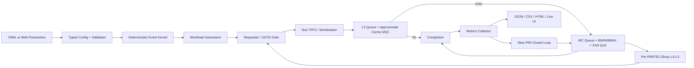
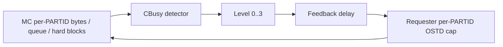

# SoC Flow Control / MPAM Simulator
# Current Architecture and Implementation Specification

## 0. Document Control

| Item | Value |
| --- | --- |
| Document status | Current implementation baseline |
| Baseline commit | `85721e3` |
| Baseline date | 2026-06-21 |
| Primary implementation | Python deterministic discrete-event simulation |
| Interactive UI | Local HTML/CSS/JavaScript console served by Python |
| Main scope | SoC flow control, L3/SLC contention, MC bandwidth/QoS, MPAM-style PARTID/PMG monitoring |
| Explicitly excluded | Cache coherency, CPU pipeline timing, detailed DRAM timing, full Arm MPAM register model |

This document describes what the current code actually does. It is intended
to be edited as the authoritative input for the next implementation change.

Normative words:

- **SHALL**: required behavior of the current baseline or requested future revision.
- **SHOULD**: recommended behavior that is not yet mandatory.
- **MAY**: optional behavior or extension point.

Implementation labels:

- **IMPLEMENTED**: directly implemented and covered by code.
- **APPROXIMATE**: implemented as a system-level behavioral approximation.
- **RESERVED**: configuration or interface exists, but behavior is not implemented.
- **OUT OF SCOPE**: intentionally excluded from the current model.
- **KNOWN GAP**: current implementation differs from the desired or documented behavior.

This specification supersedes older project text where that text still refers
to L3 CMIN/CMAX as way counts or to one shared priority value for both NoC and
memory-controller arbitration.

---

## 1. System Objective

### SYS-OBJ-001: Primary objective

The simulator SHALL evaluate causal SoC flow-control behavior:

1. how request injection creates contention;
2. where queues and backpressure accumulate;
3. how L3 allocation controls affect occupancy and hit probability;
4. how MC bandwidth and QoS controls affect service order;
5. how downstream congestion feeds back to requester OSTD;
6. how controls affect throughput, tail latency, fairness, and queue pressure.

### SYS-OBJ-002: Fidelity level

The model is a system-architecture exploration model. It is:

- not RTL;
- not cycle accurate;
- not a CPU microarchitecture model;
- not a coherent cache model;
- not a JEDEC DRAM command/timing model;
- not a full Arm MPAM architectural register emulator;
- not a Linux `resctrl`, ACPI, firmware, or hypervisor model.

### SYS-OBJ-003: Evidence boundary

Results SHALL be interpreted as model evidence for mechanism directionality
and control-loop behavior. Numerical correlation to silicon requires external
calibration of:

- queue depths;
- service parallelism;
- latency constants;
- traffic distributions;
- cache hit model;
- bandwidth windows;
- CBusy thresholds;
- software control periods.

---

## 2. Overall Architecture



### SYS-ARCH-001: Component ownership

| Component | Responsibility | Implementation |
| --- | --- | --- |
| Config loader | YAML to typed dataclasses | `src/config/loader.py` |
| Config validator | Topology and control constraints | `src/config/validator.py` |
| Event kernel | Time-ordered deterministic callbacks | `src/sim/kernel.py` |
| Workload generator | Address, operation, and injection timing | `src/traffic/generator.py` |
| Requester runtime | Global/per-PARTID OSTD and source backpressure | `src/traffic/requester.py` |
| NoC fabric | One abstract bottleneck queue and link | `src/noc/fabric.py` |
| Cache MSC | L3 queue, hit probability, sampled ownership | `src/cache/cache_msc.py` |
| MC MSC | Queue, token state, QoS scheduler, CBusy | `src/ddr/memctrl.py` |
| Settings table | Per-MSC, per-PARTID control state | `src/mpam/settings.py` |
| Slow policy | P99-driven MC QoS/BMAX update | `src/scheduler/closed_loop.py` |
| Metrics collector | Interval/cumulative metrics and traces | `src/monitor/collector.py` |
| Web server | Background jobs, experiments, verification | `src/web/server.py` |
| Web client | Configuration and live visualization | `src/web/static/` |

### SYS-ARCH-002: Request path

A request follows exactly one path:

```text
workload generator
  -> requester OSTD admission
  -> NoC
  -> requester-selected L3
  -> completion on modeled L3 hit
  -> address-selected MC on modeled L3 miss
  -> completion
```

The model has no retry from MC to L3, no coherence traffic, no snoop path, and
no writeback/eviction request path.

---

## 3. Simulation Kernel

### SIM-KERNEL-001: Event ordering

Events are ordered by:

```text
(event_time_ns, monotonically_increasing_sequence)
```

Events scheduled at the same time execute in creation order.

### SIM-KERNEL-002: Determinism

For identical:

- validated configuration;
- seed;
- Python/runtime behavior;
- event insertion order;

the simulation SHALL produce identical metrics.

Each stochastic component uses an independent deterministic seed offset:

- each cache: `simulation.seed + 100 + cache_index`;
- each workload/requester generator: `simulation.seed + 1000 + generator_index`.

### SIM-KERNEL-003: Time unit

The internal time unit is floating-point nanoseconds.

### SIM-KERNEL-004: Run termination

The kernel executes all events with:

```text
event.time_ns <= simulation_end_ns
```

Pending requests may remain incomplete at simulation end. Therefore:

```text
completion_ratio = completed_requests / issued_requests
```

may be below one.

### SIM-KERNEL-005: Control sampling

Monitor capture and slow control are scheduled every:

```text
simulation.control_interval_ns
```

The final interval is captured at simulation end if the end time is not an
exact control-period boundary.

---

## 4. Configuration Model

### CFG-001: Generic YAML interface

The generic YAML/Python model supports configurable:

- clusters and cores;
- threads per core;
- requester attachment nodes;
- explicit non-CPU requesters;
- L3 instances and sharing;
- NoC size and abstract link parameters;
- MC instances and aggregate channel bandwidth;
- PARTID/PMG definitions;
- per-MSC controls;
- workloads and policies.

### CFG-002: Interactive reference boundary

The current web console intentionally fixes:

```text
8 cores
2 hardware threads per core
16 requester rows
16 PARTID rows
PARTID 0..15
PMG 0..15 in the web editor
```

The generic YAML model is not restricted to the same core count, but the web
builder currently validates `active_cores == 8` and `threads_per_core == 2`.

### CFG-003: Main typed configuration

| Area | Key fields |
| --- | --- |
| Simulation | `time_ns`, `seed`, `control_interval_ns` |
| Cluster | `id`, `cores`, `l3` |
| L3 | `size_bytes`, `sets`, `ways`, `line_size`, `hit_latency_ns`, `queue_depth`, `lookup_parallelism` |
| NoC | `routers`, `link_bandwidth_gbps`, `router_latency_ns`, `queue_depth`, `virtual_channels`, `average_hops` |
| MC | channels, bandwidth/channel, base latency, queue, token/QoS/CBusy parameters |
| Requester | `id`, type, core/thread mapping, attach node, `max_outstanding` |
| MPAM setting | CPBM, CMIN, CMAX, BMIN, BMAX, MC QoS, CBusy, independent enables |
| Workload | requester set, PARTID/PMG, type, rate, address/locality, phase |
| Policy | `no_control`, `static_mpam`, or `closed_loop_qos` |

### CFG-004: Validation constraints

The validator currently enforces:

- positive simulation and control periods;
- at least one cache and one MC;
- unique component, requester, core, and workload IDs;
- positive L3 sets, ways, queue depth, and lookup parallelism;
- `monitor_group_sets == 8`;
- positive MC token and aging periods;
- QoS adjustment fields in `0..7`;
- ordered CBusy bandwidth and queue thresholds;
- valid requester-to-router references;
- exactly one workload injection rate;
- valid workload PARTID and requester references;
- BMIN not greater than BMAX;
- `softlimit` or `hardlimit`;
- MC QoS in `0..7`;
- `1 <= cbusy_l3_ostd <= cbusy_l2_ostd <= cbusy_l1_ostd`;
- CPBM within configured way width when a CPBM value is supplied;
- `0 <= CMIN <= CMAX <= 100` when a CPBM value is supplied;
- CMIN no greater than CPBM-reachable percentage when a CPBM value is supplied;
- enabled CMIN total no greater than 100% per L3 settings table.

### CFG-005: Compatibility aliases

The loader accepts some legacy names:

| Legacy | Current |
| --- | --- |
| `priority` | `mc_qos`, clamped to `0..7` |
| `priority_enable` | `mc_qos_enable` |
| `aging_priority_cap` | `qos_aging_max_steps`, clamped |
| `bmin_priority_boost` | `bmin_qos_promote`, clamped |
| `softlimit_priority_penalty` | `softlimit_qos_demote`, clamped |
| `cmin` | `cmin_percent` |
| `cmax` | `cmax_percent` |
| `bmin` | `bw_min_gbps` |
| `bmax` | `bw_max_gbps` |

### CFG-006: Web safety limits

The web builder rejects:

- more than 1000 control intervals;
- estimated total offered requests above 2,000,000;
- invalid 16-row PARTID/stimulus matrices;
- rates or sizes outside UI ranges;
- invalid CBusy threshold ordering.

### CFG-KNOWN-001: Policy limit-name mismatch

**KNOWN GAP**

The web builder currently writes:

```yaml
priority_min: 0
priority_max: 15
```

while `ClosedLoopQoSPolicy` reads:

```yaml
qos_min
qos_max
```

Therefore the current web-generated policy uses the code defaults:

```text
qos_min = 0
qos_max = 7
```

The legacy fields are ignored. A future revision SHOULD rename the emitted
fields and add a regression test.

### CFG-KNOWN-002: Generic CMIN/CMAX validation depends on CPBM presence

**KNOWN GAP**

In the generic YAML validator, the percentage range, CMIN/CMAX ordering, and
CPBM-reachability checks are currently nested under:

```text
cache_portion_bitmap is not None
```

The web builder always emits a CPBM value, so the interactive configuration
path receives these checks. A hand-written YAML setting that omits CPBM can
currently bypass the per-entry percentage and ordering checks. The aggregate
enabled-CMIN check still runs.

A future revision SHOULD validate CMIN/CMAX independently of whether CPBM is
present, using all ways as the reachable set when CPBM is omitted.

---

## 5. Request Data Model

### REQ-001: Request metadata

Each abstract request contains:

```text
request_id
workload_name
workload_type
requester_id
PARTID
PMG
address
size_bytes
operation
issue_time_ns
working_set_bytes
locality
source_attach_node
priority
qos_class
cache_id
memory_controller_id
```

It also accumulates:

```text
noc_delay_ns
cache_delay_ns
cache_queue_delay_ns
mem_queue_delay_ns
mem_service_delay_ns
throttle_delay_ns
cache_hit
```

### REQ-002: Latency definition

Measured completion latency is:

```text
completion_time_ns - issue_time_ns
```

The request's attributed total is:

```text
noc_delay
+ cache_delay
+ mem_queue_delay
+ mem_service_delay
+ throttle_delay
```

`cache_delay` already includes L3 admission retry, L3 queue delay, and lookup
latency. `cache_queue_delay_ns` is a diagnostic subset and SHALL not be added
again.

### REQ-KNOWN-001: Reserved metadata

`qos_class` is currently unused.

The request `priority` field is consumed by the NoC priority heap, but
`Simulation._default_priority()` always returns zero. Therefore all normal
requests currently enter NoC with neutral priority.

---

## 6. Workload and Requester Model

### TRAFFIC-001: Injection rate

MRPS conversion:

```text
requests_per_ns = injection_rate_mrps / 1000
```

Gbps conversion:

```text
requests_per_ns = injection_rate_gbps / (request_size_bytes * 8)
```

For `rate_scope == aggregate`, the rate is divided across assigned
requesters. For `per_requester`, every requester receives the full rate.

### TRAFFIC-002: Injection modes

Implemented timing modes:

- fixed interval;
- Poisson interval;
- generic burst timing if `burst_length > 1`.

### TRAFFIC-003: Address generation

`stream` distribution increments by request size and wraps in the working set.

Other distributions choose an aligned random request-size slot in the working
set.

### TRAFFIC-004: Read/write generation

The operation is sampled from `read_ratio`.

**APPROXIMATE:** read and write currently follow the same NoC/L3/MC service
path and cost. The operation field is metadata only.

### TRAFFIC-005: Requester admission

A requester may issue when both are true:

```text
requester_total_outstanding < configured_max_outstanding
PARTID_outstanding < effective_PARTID_max_outstanding
```

If blocked, the generator retries after:

```text
min(10 ns, nominal_injection_interval)
```

### TRAFFIC-006: Effective OSTD

For a PARTID:

```text
effective_ostd =
    max(1,
        min(requester.max_outstanding,
            minimum_cap_from_highest_active_CBusy_level))
```

Across multiple MCs:

1. use the maximum reported CBusy level;
2. among sources at that level, use the minimum OSTD cap.

### TRAFFIC-007: Source-stall attribution

Requester backpressure is split into:

- configured global OSTD stall;
- CBusy-derived PARTID OSTD stall.

### TRAFFIC-KNOWN-001: Workload type fidelity

**KNOWN GAP**

`pointer_chase` does not serialize requests on data dependency. It currently
uses random addresses and a lower cache-locality weight, while requester OSTD
may still allow many concurrent requests.

`bursty_dma` does not automatically set burst timing in the web builder. It
behaves as a random workload unless burst parameters are supplied through the
generic configuration.

These workload names SHALL not be interpreted as detailed CPU or DMA models.

---

## 7. NoC Model

### NOC-001: Abstract structure

The NoC is one abstract bottleneck priority queue plus one serialized link.
It is not a router-by-router network simulation.

### NOC-002: Admission

If the queue is full:

```text
retry_delay = 2 ns
```

The request accumulates NoC delay and per-PARTID backpressure.

### NOC-003: Arbitration

The internal heap key is:

```text
(-request.priority, enqueue_sequence)
```

Because normal request priority is currently zero, effective behavior is FIFO.

### NOC-004: Delay

```text
serialization_ns = request_size_bytes * 8 / link_bandwidth_gbps
fixed_latency_ns = average_hops * router_latency_ns
stage_delay_ns = queue_delay + serialization_ns + fixed_latency_ns
```

Dispatch of the next request occurs after serialization, while downstream
arrival occurs after serialization plus fixed latency.

### NOC-005: Monitoring

The NoC reports:

- utilization from serialization busy time;
- average sampled queue occupancy;
- requests and bytes;
- per-PARTID requests, bytes, delay, and admission backpressure.

### NOC-RESERVED-001: Unused configuration

`topology`, `routers`, and `virtual_channels` are preserved in configuration
and topology export, but do not create individual router/VC state.

### NOC-RESERVED-002: Future control point

NoC QoS SHALL be treated as an independent future mechanism. MC QoS SHALL not
be copied into NoC automatically.

---

## 8. L3/SLC Model

### L3-001: Request queue

Each L3 has:

- bounded FIFO waiting queue;
- `lookup_parallelism` concurrent lookup slots;
- fixed lookup duration `hit_latency_ns`.

If the waiting queue is full:

```text
retry_delay = 2 ns
```

The retry contributes to both `cache_delay_ns` and
`cache_queue_delay_ns`.

### L3-002: Lookup utilization

L3 utilization is:

```text
sum(lookup_busy_ns) /
(interval_ns * lookup_parallelism)
```

### L3-003: Hit-probability model

The modeled hit probability is:

```text
fit = min(1, allowed_capacity_bytes / working_set_bytes)

base_locality =
    low:    0.45
    medium: 0.75
    high:   0.95
    default:0.65

stream multiplier        = 0.35
pointer_chase multiplier = 0.65

hit_probability = min(0.98, 0.01 + locality_weight * fit)
```

The random draw determines the functional hit/miss result.

### L3-004: Important sampled-state boundary

**APPROXIMATE**

The sampled tag/way state does not determine the functional hit probability.
It is used for:

- approximate ownership monitoring;
- CPBM eligibility;
- CMIN replacement protection;
- CMAX sampled ownership enforcement;
- allocation-denial evidence.

Consequently, functional hit rate and sampled ownership are related through
the same capacity settings but are not an exact cache-state simulation.

### L3-005: Set and tag mapping

```text
set_index = floor(address / line_size) mod sets
tag = floor(address / (line_size * sets))
```

### L3-006: One-in-eight sampling

Only sets satisfying:

```text
set_index mod monitor_group_sets == 0
```

hold sampled way/tag state. The validator fixes `monitor_group_sets` to 8.

```text
sampled_set_count_capacity = ceil(sets / 8)
sampled_capacity_lines = sampled_set_count_capacity * ways
```

Observed sampled traffic and occupancy are scaled by 8.

### L3-007: CPBM

For a PARTID:

```text
eligible_way_indexes = bits set in CPBM
reachable_percent = popcount(CPBM) / ways * 100
```

If CPBM control is disabled, all ways are eligible.

CPBM is an allocation eligibility mask, not a security/access permission.

### L3-008: CMIN and CMAX units

CMIN and CMAX are percentages of the whole physical L3 instance.

```text
effective_cmin_percent =
    min(configured_cmin_percent, reachable_percent)

effective_cmax_percent =
    min(configured_cmax_percent or 100, reachable_percent)
```

If controls are globally disabled:

```text
effective_cmin = 0%
effective_cmax = 100%
```

### L3-009: Sampled quota conversion

```text
cmin_quota_lines =
    ceil(sampled_capacity_lines * effective_cmin_percent / 100)

cmax_quota_lines =
    floor(sampled_capacity_lines * effective_cmax_percent / 100)
```

CMIN rounds upward; CMAX rounds downward.

### L3-010: Allocation and replacement

On a sampled modeled miss:

```text
global_owned = total sampled lines owned by requester PARTID

if global_owned >= requester_cmax_quota:
    replace requester's own LRU eligible way in the current sampled set
    if none exists: deny allocation
else:
    use an empty eligible way in the current sampled set
    otherwise:
        among current-set eligible ways,
        reject a victim if its owner's global count <= owner_cmin_quota
        choose the remaining LRU victim
        if none remains: deny allocation
```

The owner count is global across all sampled sets; the victim itself is chosen
from the current sampled set.

### L3-011: CMIN meaning

CMIN is demand-driven replacement protection, not pre-allocation.

A PARTID with no demand does not receive reserved physical lines. A PARTID
must first populate sampled ownership before CMIN can protect it.

### L3-012: CMAX meaning

CMAX is an independent ceiling. CMAX values across PARTIDs may total above
100%.

### L3-013: Capacity used by hit model

```text
allowed_capacity_bytes =
    physical_cache_size_bytes * effective_cmax_percent / 100
```

CMIN does not directly increase hit probability. It influences sampled
replacement retention under contention.

### L3-014: L3 monitoring

Per PARTID:

- requests, bytes, hits, misses;
- sampled requests and bytes;
- estimated access bandwidth;
- sampled way count;
- estimated occupancy bytes;
- physical-cache occupancy share;
- allowed capacity;
- effective/configured CMIN, CMAX, CPBM;
- quota lines and reachable percentage;
- queue delay, queue-full retries, allocation denials, CMIN-protected skips.

Per `(PARTID, PMG)`:

- sampled traffic;
- estimated bandwidth;
- sampled ownership;
- estimated occupancy;
- occupancy relative to PARTID allowed capacity;
- occupancy relative to physical sampled capacity.

### L3-KNOWN-001: CMIN-protection counter semantics

`cmin_protected_evictions` counts protected victim candidates skipped while
the requesting PARTID searches for a replacement. It is not a count of actual
evictions.

### L3-KNOWN-002: Non-sampled-set behavior

Non-sampled accesses affect functional hit/miss counters but do not update
sampled ownership. CMIN/CMAX enforcement is therefore an approximation
applied through sampled sets and the capacity-based hit model.

---

## 9. Memory-Controller Model

### MC-001: Address-to-MC mapping

On an L3 miss:

```text
mc_index =
    floor(address / l3_line_size) mod number_of_memory_controllers
```

This is a simple line-interleave mapping. There is no channel/rank/bank hash.

### MC-002: Queue structure

The MC maintains:

- one FIFO deque per PARTID;
- one total queue-depth admission limit;
- one candidate per active PARTID, always its FIFO head.

If total queued requests reach `queue_depth`:

```text
retry_delay = 5 ns
```

This delay is added to memory queue delay.

### MC-003: Aggregate service bandwidth

```text
total_bandwidth_gbps =
    channels * bandwidth_gbps_per_channel

serialization_ns =
    request_size_bytes * 8 / total_bandwidth_gbps

service_delay_ns =
    base_latency_ns + serialization_ns
```

The next dispatch is scheduled after serialization, not after full service
latency. Thus base latency may overlap across requests while aggregate
serialization rate limits throughput.

`scheduler` is currently configuration metadata; it does not select different
scheduler implementations.

### MC-004: Token capacity

Both BMIN and BMAX use independent per-PARTID token states:

```text
bytes_per_ns = configured_gbps / 8
bucket_capacity_bytes =
    max(64, bytes_per_ns * token_bucket_window_ns)
```

Tokens start at zero and refill from time zero.

### MC-005: Hard BMAX

For `hardlimit`, a request is eligible only if:

```text
bmax_tokens >= request_size_bytes
```

If no candidate is eligible, the scheduler waits for the minimum token
recovery time among blocked heads.

The wait is accumulated into:

- per-request throttle delay;
- per-PARTID and per-group throttle counters;
- hard-block event counters.

### MC-006: Soft BMAX

For `softlimit`, the request always remains eligible.

It is considered over limit when its BMAX bucket lacks one request's tokens.

If the MC is considered contended, the candidate receives:

```text
softlimit_qos_demote
```

QoS levels of demotion.

### MC-007: BMIN approximation

The BMIN bucket represents bounded positive service credit.

If:

```text
bmin_tokens >= request_size_bytes
```

the candidate receives:

```text
bmin_qos_promote
```

QoS levels of promotion. Credit is consumed when the request dispatches.

BMIN is a preference approximation, not a hard reservation or real-time
guarantee.

### MC-008: 3-bit QoS

Base MC QoS is per PARTID:

```text
0..7, where 7 is highest
```

If MC QoS is disabled, base QoS is zero while the configured value is retained.

### MC-009: Aging

```text
aging_steps =
    min(qos_aging_max_steps,
        floor(queue_age_ns / aging_ns))
```

### MC-010: Effective QoS

For every eligible PARTID-head candidate:

```text
effective_qos = clamp(
    base_mc_qos
  + aging_steps
  + bmin_qos_promote_if_credited
  - softlimit_qos_demote_if_over_and_contended,
    0,
    7)
```

### MC-011: Arbitration

Selection order:

1. remove hard-BMAX-ineligible candidates;
2. choose highest `effective_qos`;
3. for equal QoS, choose the oldest global enqueue sequence.

Per-PARTID ordering remains FIFO.

### MC-012: Contention definition

The current MC implementation defines:

```text
contended = total_MC_queue_length > 1
```

**KNOWN GAP:** this does not require multiple PARTIDs. Two queued requests
from one PARTID satisfy the condition. The QoS demotion does not change the
winner when there is only one active PARTID head, but demotion counters may
still report activity.

### MC-013: MC monitoring

Per PARTID:

- requests and bytes;
- achieved bandwidth;
- queue, service, and throttle delay;
- configured/effective BMIN/BMAX and mode;
- configured/base/effective QoS;
- QoS minimum, maximum, and request-weighted average;
- promotion, demotion, aging-step counters;
- soft-over-limit requests and bytes;
- hard-block events;
- CBusy evidence.

Per `(PARTID, PMG)`:

- serviced requests and bytes;
- queue/service/throttle delay;
- achieved bandwidth and utilization;
- active BMIN/BMAX/QoS/CBusy values.

### MC-KNOWN-001: Initial token transient

Because token buckets initialize at zero, hard BMAX can produce an initial
startup delay. The current model has no configurable initial token fill.

### MC-KNOWN-002: Aggregate channel model

Channels contribute only to total bandwidth. The model has no:

- channel selection;
- bank conflicts;
- row hits/misses;
- read/write turnaround;
- refresh;
- command bus;
- rank timing;
- FR-FCFS state.

---

## 10. CBusy Fast Feedback Loop

### CBUSY-001: Loop structure



### CBUSY-002: Sampling

Every MC evaluates each configured/active PARTID every:

```text
cbusy_sample_ns
```

### CBUSY-003: Detector inputs

```text
sample_bandwidth =
    sampled_bytes * 8 / cbusy_sample_ns

bandwidth_ratio =
    sample_bandwidth / BMAX
    only when BMAX is enabled and positive

queue_ratio =
    queued_requests_for_PARTID / MC_total_queue_depth
```

Hard-block activity is also an input.

### CBUSY-004: Level selection

For candidate levels 1, 2, and 3, a level matches if either:

```text
queue_ratio >= level_queue_threshold
```

or:

```text
BMAX enabled
and MC total queue length > 1
and bandwidth_ratio >= level_bandwidth_threshold
```

The highest matching level is selected.

If hard-block activity is non-zero:

```text
detected_level = max(detected_level, 2)
```

### CBUSY-005: Assertion and release

- Higher detected level asserts immediately.
- Lower detected level increments a release counter.
- After `cbusy_release_hold_samples`, the current level decreases by one.
- Release is stepwise; it does not jump directly to the detected lower level.

### CBUSY-006: Feedback transport

A level change is delivered after:

```text
cbusy_feedback_latency_ns
```

The delivered event is recorded as a control trace with policy `mc_cbusy`.

### CBUSY-007: OSTD caps

```text
level 1 -> cbusy_l1_ostd
level 2 -> cbusy_l2_ostd
level 3 -> cbusy_l3_ostd
```

Level 0 removes the CBusy-derived clamp.

### CBUSY-008: Monitoring

The MC reports:

- current level;
- last and interval-peak bandwidth ratio;
- last and interval-peak queue ratio;
- transition and assertion count;
- active duty ratio;
- current OSTD cap.

The requester reports:

- effective OSTD;
- current maximum CBusy level;
- CBusy transitions;
- CBusy-attributed source stall.

### CBUSY-KNOWN-001: Request-class blindness

CBusy currently throttles all requests of a PARTID equally. It does not
distinguish demand, prefetch, instruction, data, writeback, DMA, or table-walk
classes.

---

## 11. Slow Closed-Loop Policy

### POLICY-001: Modes

| Mode | Enforcement |
| --- | --- |
| `no_control` | L3/MC controls and CBusy enforcement disabled; monitors remain |
| `static_mpam` | Configured controls active; no slow updates |
| `closed_loop_qos` | Configured controls active plus interval P99 policy |

Global enforcement is disabled only when the policy list contains exactly one
policy named `no_control`.

### POLICY-002: Protected/background derivation in web UI

- protected PARTIDs: any enabled stimulus with positive P99 target;
- background PARTIDs: active PARTIDs minus protected PARTIDs.

### POLICY-003: Violation condition

For a protected PARTID with interval completions:

```text
interval_p99 >
target_p99 * (1 + p99_hysteresis)
```

### POLICY-004: Violation action

When any protected PARTID violates:

For every MC:

1. increase every enabled protected PARTID MC QoS by one, capped by `qos_max`;
2. multiply every enabled background BMAX by:

```text
1 - max_bw_step_percent / 100
```

with a lower floor of `0.001 Gbps`.

### POLICY-005: Relax condition

All protected PARTIDs must be below:

```text
target_p99 * (1 - p99_hysteresis)
```

### POLICY-006: Relax action

Background BMAX values are increased toward their initial values by:

```text
current_bmax * (1 + max_bw_step_percent / 100)
```

and clamped to the initial BMAX.

### POLICY-007: Hold time

Updates are separated by at least:

```text
min_hold_intervals
```

control intervals.

### POLICY-KNOWN-001: Protected QoS does not relax

**KNOWN GAP**

The current relax path restores background BMAX only. It does not reduce
protected MC QoS. Therefore protected QoS is monotonic non-decreasing during
a run and may remain at the maximum after a transient violation.

### POLICY-KNOWN-002: Limited control objectives

The slow policy does not directly control:

- L3 CMIN/CMAX/CPBM;
- CBusy thresholds;
- requester base OSTD;
- NoC QoS;
- BMIN;
- fairness;
- throughput loss;
- queue targets.

---

## 12. Monitoring and Metrics

### MON-001: Interval PARTID metrics

For completed requests in each interval:

- requests and bytes;
- throughput;
- average, P50, P95, P99, P99.9, maximum latency;
- average NoC delay;
- average cache delay;
- average cache queue delay;
- average MC queue delay;
- average MC service delay;
- average throttle delay;
- cache hits, misses, and hit rate.

### MON-002: Percentile method

Percentiles use sorted values and linear interpolation:

```text
position = (N - 1) * percentile / 100
```

### MON-003: Cumulative metrics

Cumulative metrics use the complete-run elapsed time as the throughput
denominator.

### MON-004: Request timeline sampling

Completed-request traces are retained when:

- full request tracing is enabled; or
- completion index is within the first 1000; or
- completion index is a multiple of 100.

The in-memory timeline is capped at 20,000 rows. The web job returns the last
3000 timeline rows.

### MON-005: Control trace

Every slow update and delivered CBusy transition records:

```text
time_ns
policy
target_msc
PARTID
field
old_value
new_value
reason
```

### MON-006: Monitor enable semantics

**KNOWN GAP**

`monitor_enable` is reported in snapshots, but currently does not suppress
counter collection or UI visibility.

### MON-007: Multi-MSC aggregation

The web UI generally sums:

- usage across L3s/MCs;
- capacity across L3s/MCs;
- BMIN/BMAX values across MC instances.

Ratios SHOULD be computed after summing numerator and denominator.

---

## 13. Output Artifacts

### OUT-001: Exported files

Each completed run may emit:

```text
run_summary.json
resolved_config.json
topology.json
metrics.csv
per_cpu_partid.csv
per_partid_latency.csv
per_msc_utilization.csv
control_trace.csv
timeline_trace.csv
report.html
```

### OUT-002: Static report

The report includes:

- modeled flow;
- run summary;
- P99, throughput, and throttle charts;
- control updates;
- topology table.

### OUT-KNOWN-001: Static-report terminology

The static report still labels one stage as `Priority scheduler`. The current
MC implementation is 3-bit QoS and current NoC arbitration is neutral. This
label SHOULD be updated in a future cleanup.

### OUT-KNOWN-002: Resolved config source

`resolved_config.json` currently exports `ProjectConfig.raw`, which is the
input YAML dictionary. Runtime policy updates are not written back into it.

---

## 14. Interactive Web Console

### UI-001: Server architecture

The UI is served by Python `ThreadingHTTPServer`. Simulation jobs execute in
daemon threads and expose polling snapshots.

### UI-002: HTTP endpoints

| Method | Endpoint | Purpose |
| --- | --- | --- |
| GET | `/` | Main console |
| GET | `/api/defaults` | Web parameter defaults |
| POST | `/api/jobs` | Start one simulation |
| GET | `/api/jobs/<id>` | Poll one simulation |
| POST | `/api/experiments` | Start four-case BMAX/CBusy experiment |
| GET | `/api/experiments/<id>` | Poll experiment |
| POST | `/api/verifications` | Start algorithm verification suite |
| GET | `/api/verifications/<id>` | Poll verification |
| GET | `/runs/<path>` | Serve generated artifacts |

POST bodies are limited to 1,000,000 bytes.

### UI-003: Configuration views

- SoC timing/topology/capacity;
- 16 independent hardware-thread stimuli;
- 16 PARTID MPAM control rows;
- policy and fast/slow control parameters.

### UI-004: Result views

- CPU/L3/MC resource monitor;
- 16-PARTID control-effect overview;
- selected-PARTID effect timeline;
- four-case experiment;
- algorithm verification;
- CBusy causal timeline;
- PARTID summary;
- `(PARTID, PMG)` monitor groups;
- MPAM aggregate monitor;
- component monitor;
- control trace.

### UI-005: Algorithm explanations

Tagged controls and metrics open one anchored algorithm popover. The normal
tooltip is suppressed on the same target to avoid overlap.

### UI-006: Control-effect target construction

For the selected PARTID:

```text
L3 target = configured per-L3 CMIN/CMAX percentages

aggregate BMIN target =
    configured per-MC BMIN * number_of_MCs

aggregate BMAX target =
    configured per-MC BMAX * number_of_MCs

P99 target =
    minimum positive target among enabled stimuli using the PARTID
```

### UI-007: L3 effect-state heuristic

L3 pressure evidence is true when any cache snapshot for the PARTID reports:

```text
allocation_denials > 0
or cmin_protected_evictions > 0
```

Failure rules:

```text
actual_share > CMAX + 1 percentage point
or
pressure exists and actual_share + 1 percentage point < CMIN
```

Without replacement pressure, a low CMIN occupancy is shown as observation,
not failure.

### UI-008: MC effect-state heuristic

MC contention evidence is true when any MC has:

```text
queue_occupancy > 1
or utilization > 0.8
```

Failure rules:

```text
hard BMAX:
actual_bandwidth > target_BMAX * 1.08

BMIN:
contention exists and actual_bandwidth + 0.5 Gbps < target_BMIN
```

Soft-BMAX excess without a failure is displayed as borrowing.

### UI-KNOWN-001: Overview is latest-interval state

**KNOWN GAP**

The overview table uses the latest visible interval for state classification.
The selected-PARTID charts show the full run, but the overview does not yet
calculate time-in-compliance, violation duration, overshoot area, or worst
interval.

### UI-KNOWN-002: Client-side heuristic

Control-effect pass/fail state is calculated in JavaScript and is not exported
as a server-side canonical result. Future automated signoff SHOULD move the
calculation into a tested Python analysis module.

---

## 15. Controlled Experiments

### EXP-001: Four-case BMAX/CBusy experiment

Cases:

1. reference: BMAX off, CBusy off;
2. BMAX only;
3. CBusy only;
4. BMAX plus CBusy.

All cases:

- preserve topology, workload, timing, and seed;
- force `static_mpam`;
- disable CPBM, CMIN, CMAX, BMIN, and MC QoS;
- vary only BMAX and CBusy enable states for active PARTIDs.

### EXP-002: Reported evidence

System level:

- throughput;
- maximum P99;
- completion ratio;
- MC queue peak;
- queue area;
- throttle delay;
- hard blocks;
- CBusy stall;
- configured-OSTD stall;
- CBusy transitions.

Per PARTID:

- throughput and P99;
- queue ratio peak;
- effective OSTD minimum;
- source stalls;
- throttle and hard blocks.

---

## 16. Built-In Algorithm Verification

### VERIFY-001: Suite structure

The current suite runs 13 deterministic cases and evaluates 7 checks.

### VERIFY-002: CMIN check

Topology:

```text
1 L3
8 sets
16 ways
one sampled set
```

Protected traffic starts before aggressor traffic.

Pass intent:

- CMIN 50% retains at least 8 sampled ways;
- enabled case retains more than disabled case;
- protected victim skips are observed.

### VERIFY-003: CMAX check

Pass intent:

- CMAX 12.5% owns no more than 2 of 16 sampled lines;
- unrestricted case owns more.

### VERIFY-004: MC QoS check

Compare equal QoS `3/3` with split QoS `7/0`.

Pass intent:

- selected effective QoS is high;
- QoS-7 PARTID gains more than 5% throughput over its equal-QoS case.

### VERIFY-005: BMIN check

Pass intent:

- BMIN promotion requests are observed;
- protected throughput improves by more than 5%.

### VERIFY-006: Soft BMAX without contention

Pass intent:

- over-limit soft requests are observed;
- soft throughput remains at least 85% of BMAX-disabled throughput.

### VERIFY-007: Hard BMAX

For 10 Gbps configured BMAX:

- hard blocks and throttle delay must be non-zero;
- throughput must be no more than 12.5 Gbps.

### VERIFY-008: Soft BMAX with contention

Pass intent:

- demotion events are observed;
- controlled throughput is below 95% of BMAX-disabled contended throughput.

### VERIFY-KNOWN-001: Stale evidence wording

The verification UI/server evidence string for CMIN still says `CMIN=8`
although the user-facing configuration is now `CMIN=50%`, which maps to 8 of
16 sampled lines in this microbenchmark. The formula is correct; the wording
SHOULD be updated.

---

## 17. Current Test Contract

The test suite currently proves:

- baseline configuration loads;
- invalid requesters fail;
- CMIN overcommit and CPBM reachability fail;
- MC QoS is limited to 3 bits;
- fixed seed is deterministic;
- hard BMAX produces bounded throughput and throttle delay;
- larger cache portion improves modeled hit rate and latency;
- L3 queue pressure/backpressure is observable;
- all 16 PARTID monitor rows exist;
- soft limit is work-conserving relative to hard limit;
- no-control preserves monitors and neutral effective controls;
- `(PARTID, PMG)` monitoring works;
- CPU outstanding monitoring works;
- independent control switches report neutral effective values;
- BMAX and CBusy can be isolated and combined;
- per-requester rate scales with requester count;
- higher MC QoS reduces protected queue delay and P99;
- web configuration and experiment derivation are valid;
- all 7 built-in algorithm checks pass.

Current baseline:

```text
28 pytest tests passing
4 archived OpenSpec capability specs passing strict validation
```

---

## 18. Capability Status

| Capability | Status | Current meaning |
| --- | --- | --- |
| PARTID | IMPLEMENTED | Per-request control identity |
| PMG | IMPLEMENTED | Monitor attribution only |
| 16 web PARTIDs | IMPLEMENTED | Fixed web reference table |
| Per-MSC settings | IMPLEMENTED | Independent L3 and MC tables |
| CPBM | APPROXIMATE | Sampled-way eligibility and capacity reachability |
| CMIN | APPROXIMATE | Global sampled-owner replacement protection |
| CMAX | APPROXIMATE | Global sampled-owner ceiling and hit capacity |
| CSU | APPROXIMATE | One sampled set per 8 sets |
| MBWU | IMPLEMENTED behaviorally | Interval serviced bandwidth |
| BMAX hard | IMPLEMENTED behaviorally | Token eligibility blocking |
| BMAX soft | IMPLEMENTED behaviorally | Work-conserving QoS demotion |
| BMIN | APPROXIMATE | Positive credit and QoS promotion |
| MC 3-bit QoS | IMPLEMENTED | Local MC arbitration only |
| NoC QoS | RESERVED | Internal heap exists; requests are neutral |
| CBusy | APPROXIMATE | Per-MC, per-PARTID L0-L3 feedback |
| PE OSTD control | IMPLEMENTED behaviorally | Requester issue clamp |
| Slow P99 loop | IMPLEMENTED | MC QoS increase and background BMAX reduction |
| Exact cache tags | OUT OF SCOPE | Only sampled tags exist |
| Coherency | OUT OF SCOPE | No snoops or sharing protocol |
| DRAM timing | OUT OF SCOPE | Aggregate service only |
| MPAM registers | OUT OF SCOPE | No feature pages/register encoding |
| ACPI/Linux integration | OUT OF SCOPE | YAML/web are control plane |
| Security spaces | OUT OF SCOPE | No Secure/Realm/Root namespace |
| SMMU/device tagging | RESERVED | Explicit requester interface exists |

---

## 19. Modification Interfaces

The following are the preferred places to change behavior.

### MOD-001: Add a new request attribute

Modify:

- `src/traffic/request.py`;
- generator population;
- relevant component consumption;
- timeline/export fields;
- UI aggregation if visible.

### MOD-002: Add a new per-PARTID control

Modify:

1. `MPAMSettingConfig`;
2. runtime `MPAMSetting`;
3. loader and validator;
4. web default/parse/build path;
5. enforcement component;
6. monitor snapshot;
7. UI editor and help;
8. mechanism verification;
9. OpenSpec capability spec.

### MOD-003: Replace the L3 algorithm

Primary replacement points:

- `_hit_probability`;
- `_sample_access`;
- `_choose_victim`;
- `_effective_min_percent`;
- `_effective_max_percent`;
- monitor quota/occupancy calculations.

A future exact-cache model SHOULD preserve the existing `CacheMSC.receive`,
callback, settings-table, and monitor interfaces.

### MOD-004: Replace the MC scheduler

Primary replacement points:

- `_eligible`;
- `_select_request`;
- `_consume_tokens`;
- dispatch cadence;
- monitor evidence.

A future scheduler MAY implement WRR, DRR, stride, deficit/credit, deadline,
FR-FCFS, or channel-aware arbitration behind the same component boundary.

### MOD-005: Add NoC QoS

Define separately:

- control field and range;
- PARTID-to-class mapping;
- whether aging exists;
- whether rate control exists;
- queue/VC scope;
- interaction with MC QoS;
- monitor counters;
- starvation protection.

Do not reuse MC QoS implicitly.

### MOD-006: Extend CBusy

Candidate extensions:

- request classes;
- route/destination-aware feedback;
- bandwidth debt;
- queue-watermark hysteresis;
- minimum assertion hold;
- gradual OSTD recovery;
- separate read/write signals;
- per-requester rather than global PARTID delivery.

### MOD-007: Extend the slow loop

Define:

- controlled variables;
- objective function;
- constraints;
- update law;
- saturation;
- anti-windup;
- hysteresis;
- hold period;
- recovery behavior;
- stability and oscillation KPIs.

---

## 20. Recommended Next Decisions

These decisions should be resolved before increasing fidelity.

### DEC-001: L3 target semantics

Choose whether CMIN/CMAX are:

- percentages of each L3 instance;
- percentages of the sum of all L3 instances;
- percentages within CPBM reachability;
- proportional targets enforced by a controller rather than sampled quotas.

Current choice: percentage of each physical L3 instance, intersected with
CPBM reachability.

### DEC-002: BMIN semantics

Choose:

- positive credit promotion, current;
- signed deficit;
- guaranteed weighted service;
- minimum over a configured measurement window;
- reservation plus borrowing.

### DEC-003: MC contention definition

Choose:

- total queued requests greater than one, current;
- more than one active PARTID;
- utilization threshold;
- queue threshold;
- scheduler has at least two eligible candidates.

### DEC-004: CBusy source

Choose which evidence should assert each level:

- BMAX ratio;
- actual MC utilization;
- queue depth;
- hard-token debt;
- latency;
- bank/channel pressure;
- downstream credit state.

### DEC-005: Control-effect signoff

Choose canonical metrics:

- latest interval;
- worst interval;
- percentage of time compliant;
- violation duration;
- overshoot area;
- convergence time;
- recovery time;
- throughput cost;
- P99/P99.9 change;
- starvation threshold.

### DEC-006: Workload fidelity

Choose whether to add:

- true dependent pointer chase;
- prefetch traffic;
- read/write asymmetry;
- DMA bursts;
- cache writebacks;
- page walks;
- instruction/data classes;
- phased workload start/stop profiles.

---

## 21. Change Proposal Template

Edit this section or copy it into a new document.

```text
Change title:

Problem:

Observed evidence:

Affected requirement IDs:

New behavior:

Algorithm or state machine:

Configuration fields:

Monitor fields:

UI changes:

Compatibility requirements:

Pass/fail criteria:

Required deterministic test cases:

Explicit non-goals:
```

For algorithm changes, provide:

```text
input state
output/action
update period
units
clamps/saturation
tie-breaking
startup state
recovery state
multi-MSC aggregation
failure/forward-progress behavior
```

---

## 22. Traceability Index

| Requirement family | Main code |
| --- | --- |
| `SIM-*` | `src/sim/` |
| `CFG-*` | `src/config/`, `src/web/config_builder.py` |
| `REQ-*` | `src/traffic/request.py` |
| `TRAFFIC-*` | `src/traffic/generator.py`, `requester.py` |
| `NOC-*` | `src/noc/fabric.py` |
| `L3-*` | `src/cache/cache_msc.py` |
| `MC-*` | `src/ddr/memctrl.py` |
| `CBUSY-*` | `src/ddr/memctrl.py`, `src/traffic/requester.py` |
| `POLICY-*` | `src/scheduler/closed_loop.py` |
| `MON-*`, `OUT-*` | `src/monitor/` |
| `UI-*`, `EXP-*`, `VERIFY-*` | `src/web/` |

The archived OpenSpec change that introduced proportional L3 controls,
3-bit MC QoS, and the effect view is:

```text
openspec/changes/archive/
  2026-06-20-add-qos-proportional-cache-and-effect-view/
```

---

## 23. Agreed Revision Decisions

Status of this section:

```text
AGREED SPECIFICATION DIRECTION
NOT YET IMPLEMENTED UNLESS ALSO STATED IN SECTIONS 1-22
```

This section records decisions made during the chapter-by-chapter model
review. It must not be interpreted as a claim that the current code already
implements the behavior.

### REV-VERIFY-001: Control activation is not target achievement

Automated verification SHALL prove that a configured control is active and
that its defined causal path executes:

```text
trigger condition
-> monitor update
-> control decision
-> enforcement action
-> observable effect at the controlled resource
```

Automated verification SHALL NOT require every control target to be achieved.
A target may legitimately remain unmet because of:

- insufficient demand;
- insufficient physical resource;
- conflicting controls;
- sampling or filtering error;
- control saturation;
- response latency;
- an implementation-defined work-conserving policy;
- an intentionally limited control algorithm.

Tests SHALL distinguish:

- control disabled;
- control enabled but not triggered;
- control triggered and action applied;
- control saturated;
- target achieved;
- target not achieved.

### REV-ARCH-001: Data, monitor, and control planes

The revised model SHALL separate:

| Plane | Role |
| --- | --- |
| Data plane | Full modeled request, cache-set/way, queue, arbitration, and service state |
| Monitor plane | MPAM-visible sampled and filtered values |
| Control plane | Decisions and enforcement based on MPAM monitor values |

Control algorithms SHALL consume MPAM monitor-plane values. They SHALL NOT
read complete data-plane state unless a specific control is explicitly
defined as having a direct hardware signal.

The UI MAY expose complete data-plane state for verification and diagnosis,
but SHALL label it separately from MPAM-visible monitoring.

### REV-MON-001: Per-resource monitor clocks

L3 and MC monitoring SHALL have independent clock configuration:

```yaml
l3_clock_mhz: <positive number>
mc_clock_mhz: <positive number>
l3_monitor_period_cycles: 256
mc_monitor_period_cycles: 256
```

The default monitor period is 256 local resource-clock cycles. The event
kernel SHALL convert each resource's cycle period to simulation time.

### REV-MON-002: Configurable recursive filter

L3 and MC monitors SHALL update once per monitor period using a configurable
history/current weighted filter:

```text
filtered[k] =
    history_weight * filtered[k-1]
  + current_weight * raw[k]
```

The user interface SHALL expose `history_weight` and `current_weight`.
Configuration validation SHALL define one normalization rule. The preferred
hardware-oriented representation is:

```text
history_weight + current_weight = 256

filtered[k] =
    (history_weight * filtered[k-1]
   + current_weight * raw[k]) / 256
```

The startup value and integer rounding rule remain to be decided before
implementation.

### REV-L3-MON-001: One-set-per-eight-set occupancy sampling

Every consecutive eight L3 sets form one monitor group:

```text
group_index = floor(set_index / 8)
sample_set_index = group_index * 8
```

At each L3 monitor update, the monitor SHALL inspect every way in the first
set of each eight-set group. For every PARTID:

```text
sampled_lines[partid] =
    count(sampled ways whose owner PARTID equals partid)

raw_sampled_occupancy_share[partid] =
    sampled_lines[partid] /
    (monitor_group_count * ways_per_set)
```

The other seven sets are not read by the MPAM occupancy monitor. Their way
owners may differ because of address-to-set interleaving and replacement.

### REV-L3-MON-002: Actual versus monitored occupancy

The revised L3 data plane SHALL maintain modeled tag, owner PARTID, and
replacement state for all sets and ways, while the MPAM monitor plane SHALL
continue sampling only one set per eight-set group.

The following values SHALL remain separate:

| Value | Meaning | Controller visibility |
| --- | --- | --- |
| Actual occupancy | Ownership across all modeled sets and ways | No |
| Raw sampled occupancy | Current one-in-eight-set sample | Yes |
| Filtered occupancy | Recursive filtered MPAM monitor value | Yes |

The difference between actual and monitored occupancy is expected model
behavior, not automatically an error.

### REV-MC-MON-001: Per-PARTID bandwidth monitoring

Every MC SHALL record serviced bytes for all PARTIDs during each local
256-cycle monitor period:

```text
raw_bandwidth_gbps[partid] =
    serviced_bytes[partid] * 8 / monitor_period_ns
```

The MC SHALL update a filtered bandwidth value using `REV-MON-002`. MC
bandwidth controls that are defined as monitor-driven SHALL use this filtered
MPAM value.

Each MC instance SHALL monitor and control independently. UI aggregation
across MCs is a presentation function and SHALL NOT silently become a control
input.

### REV-MAP-001: Configurable address interleaving

Address mapping SHALL be deterministic and user configurable. At minimum, the
model SHALL support:

```yaml
mapping_mode: linear | xor
line_size_bytes: <positive power of two>
mc_interleave_bytes: <positive multiple of line size>
xor_shift: <non-negative integer>
```

The base line address is:

```text
line_address = floor(address / line_size_bytes)
```

Linear mapping:

```text
l3_set = line_address mod l3_set_count
mc_id = floor(address / mc_interleave_bytes) mod mc_count
```

XOR mapping:

```text
mapped_line = line_address XOR (line_address >> xor_shift)
l3_set = mapped_line mod l3_set_count
mc_id =
    floor(mapped_line / (mc_interleave_bytes / line_size_bytes))
    mod mc_count
```

The exact ordering of L3-set and MC selection transforms, as well as any
future slice/channel/bank mapping, SHALL be explicit rather than hidden in
traffic-generation code.

### REV-UI-001: PARTID-selectable time-series evidence

Every resource time-series view SHALL allow:

- selecting one PARTID;
- selecting multiple PARTIDs;
- hiding all unselected PARTIDs consistently;
- selecting an individual L3 or MC instance;
- switching to an explicitly labeled aggregate view;
- using a shared time cursor;
- zooming to a time range;
- locating control events.

Every plot SHALL include a clear legend. Line style and color SHALL
distinguish:

- configured target;
- effective target after enable/clamp/policy processing;
- actual data-plane value;
- raw MPAM sample;
- filtered MPAM monitor value;
- control action or state transition.

Disabled and unavailable signals SHALL be shown as such; they SHALL NOT be
rendered as numeric zero.

### REV-UI-002: Monitor-error visibility

For L3 occupancy and MC bandwidth, the UI SHALL make sampling/filtering error
visible:

```text
monitor_error = filtered_MPAM_value - actual_data_plane_value
```

At minimum, users SHALL be able to plot actual, raw sampled, and filtered
values together. The UI SHOULD also provide absolute error and relative error,
with relative error suppressed or specially labeled when the actual value is
zero.

### REV-MON-003: Monitor/control update order

At each resource monitor boundary, the update order SHALL be deterministic:

```text
1. close current-period access/service counters
2. read the resource's raw monitor sample
3. calculate the new filtered monitor value
4. publish monitor state
5. evaluate monitor-driven control logic
6. publish and apply the resulting control action
7. clear only the current-period counters
8. retain the filtered value as next period's history
```

The trace SHALL preserve the monitor sample time, decision time, and action
effective time so that feedback delay is visible.
