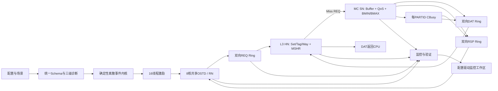

# SoC系统流控与MPAM仿真器总体规格

## 0. 文档控制

| 项目 | 内容 |
| --- | --- |
| 文档状态 | 已确认的目标架构与实现基线 |
| 文档日期 | 2026-06-23 |
| 当前代码基线 | `4237166`之后的P0机制可信性审视 |
| 仿真方法 | 确定性离散事件仿真 |
| 参考拓扑 | 8核、每核2线程、16个硬件线程、16个PARTID |
| 研究重点 | 系统流控、MPAM监控与控制、控制动态和PPA折中 |
| 暂不覆盖 | 完整一致性、完整CHI协议、CPU流水线、精确DRAM时序 |

本文是后续代码修改的权威规格。当前代码尚未全部实现本文目标行为，
第17章明确列出当前实现与目标规格的差异。

### 0.1 文档语言

本文及后续OpenSpec提案、设计、差异规格和任务说明均使用中文正文。
需求ID、代码符号、配置字段、寄存器名、协议名和公式保留英文。

### 0.2 规范用语

- **必须**：实现和验证必须满足。
- **应当**：推荐实现，偏离时必须说明原因。
- **可以**：可选能力。
- **当前实现**：代码已经具备。
- **目标实现**：已确认但尚待实现。
- **近似模型**：有意降低硬件细节的系统级模型。
- **预留接口**：接口存在或已定义，但行为尚未实现。
- **范围外**：当前阶段不实现。

### 0.3 基本原则

1. 验证控制是否按规则生效，不假设控制目标必然达到。
2. 控制器只能读取规格允许的硬件信号或MPAM监控值。
3. 仿真可以保留更丰富的观测状态，但不得让其暗中参与硬件决策。
4. 每个控制逻辑必须说明底层状态、更新周期、动作点、饱和和恢复。
5. 控制效果必须能沿时间轴被用户观察和解释。
6. 新特性通过模块接口和策略扩展，不在主仿真流程堆积特例。

### 0.4 P0完成定义

P0是**机制可信性验收**，不是**控制效果达标验收**。
P0完成只需要满足：

1. 各控制机制独立微测试通过；
2. 控制器没有读取未授权的actual状态；
3. 监控、决策和动作时序无零周期偷跑；
4. 两条最小端到端因果链能够完整追踪；
5. 目标未达和控制饱和不会终止仿真；
6. 相同输入能够确定性复现；
7. 不新增阶段专用仿真模式、数据模型和UI通路。

P0允许控制目标未达、过冲、振荡、饱和、不可行或控制导致性能恶化。
这些情况必须作为`CONTROL_OUTCOME`导出证据，不得作为模型错误。

---

## 1. 模型目标与边界

### SYS-OBJ-001：核心目标

模型用于研究以下因果链：

```text
激励和内存级并行度
-> CPU/RN请求准入
-> NoC传输和反压
-> L3命中、miss和资源分配
-> MC排队、QoS和带宽控制
-> CBusy反馈
-> CPU OSTD变化
-> 吞吐、延迟、占用和公平性结果
```

模型必须能够回答：

- 控制触发条件是否被正确识别；
- 控制状态机是否按规则变化；
- 控制动作是否作用到正确资源和PARTID；
- 目标达到、未达到或饱和的原因；
- 采样、滤波、反馈延迟和PPA折中造成的动态效果。

### SYS-OBJ-002：可信度分层

模型目标分为：

1. **机制正确性**：状态、动作和约束符合规格。
2. **系统趋势可信**：能够解释排队、反压、过冲、振荡和资源竞争方向。
3. **绝对性能预测**：需要RTL、FPGA或硅片数据校准，当前不作承诺。

### SYS-OBJ-003：明确范围

当前纳入：

- PARTID/PMG标签；
- 16组L3和MC设置；
- CPU共享OSTD和源端准入；
- REQ/RSP/DAT三条bufferless ring；
- 真实L3 set/tag/way、MSHR和fill；
- CPBM、CMIN、CMAX；
- MC共享buffer、3-bit QoS、BMIN和BMAX；
- 四档CBusy及RN OSTD反馈；
- MPAM原始监控、滤波监控和实际值对照；
- 用户可配置控制开关、场景和可视化。

当前范围外：

- L1/L2私有缓存和完整一致性状态；
- SNP事务处理；
- 完整CHI合法性、排序、DVM和重试；
- CPU ROB、分支预测和指令提交；
- 精确TLB、页表遍历和内存屏障；
- DRAM bank、row、refresh、turnaround和FR-FCFS；
- 完整Arm MPAM寄存器和异常模型；
- 完整ACPI、固件和虚拟化实现。

---

## 2. 总体架构



### SYS-ARCH-001：三平面

| 平面 | 内容 | 控制器可见性 |
| --- | --- | --- |
| 数据面 | 完整请求、set/way、buffer、Ring槽位和服务状态 | 仅明确授权的信号 |
| 监控面 | MPAM采样值、滤波值、事件和计数器 | 是 |
| 控制面 | CPBM、CMIN/CMAX、BMIN/BMAX、QoS、CBusy、OSTD动作 | 读取规定输入 |

控制器不得读取完整数据面真实值，除非该控制明确具有直接硬件信号。
UI可以显示真实值，用于验证监控误差，但必须与MPAM可见值分开标注。

### SYS-ARCH-002：节点

| 节点 | 作用 |
| --- | --- |
| RN | CPU请求节点，每个物理核一个 |
| HN | L3/Home节点 |
| SN | MC/内存服务节点 |

### SYS-ARCH-003：最小读流程

L3 hit：

```text
线程请求
-> RN分配OSTD
-> REQ Ring
-> L3 lookup
-> DAT Ring
-> CPU完成
-> 释放OSTD
```

L3 miss：

```text
线程请求
-> RN分配OSTD
-> REQ Ring
-> L3 lookup和MSHR
-> REQ Ring到MC
-> MC服务
-> DAT Ring返回L3
-> L3 fill
-> DAT Ring返回CPU
-> 释放OSTD、MSHR和fill资源
```

---

## 3. 仿真内核与时间

### SIM-001：事件顺序

事件按以下键排序：

```text
(event_time_ns, monotonically_increasing_sequence)
```

相同时间的事件按创建顺序执行。

### SIM-002：确定性

以下输入相同时，结果必须一致：

- resolved config；
- seed；
- 组件实现版本；
- 事件插入顺序。

### SIM-003：时钟域

至少支持：

```yaml
cpu_clock_mhz:
noc_clock_mhz:
l3_clock_mhz:
mc_clock_mhz:
```

组件的周期数必须转换为统一纳秒时间，同时在监控记录中保留本地周期。

### SIM-004：运行终止

仿真执行所有时间不超过结束时间的事件。结束时允许存在未完成事务，
但必须报告：

- issued；
- completed；
- completion ratio；
- 各资源剩余事务；
- 未完成原因。

---

## 4. 配置、诊断与复现

### CFG-001：统一配置源

Web、YAML和Python API使用同一类型化schema：

```text
用户输入
-> 统一配置对象
-> 校验和派生计算
-> resolved config
-> 仿真
```

UI不得维护隐藏默认值。

### CFG-002：基础与高级配置

基础配置：

- 仿真时长、seed和验证等级；
- CPU/L3/MC/NoC时钟；
- 16线程激励及PARTID/PMG；
- CPBM、CMIN、CMAX；
- BMIN、BMAX、MC QoS、CBusy；
- 监控周期和滤波权重。

高级配置：

- OSTD分配策略、发射窗口、pointer chains；
- MSHR、fill buffer、LRU/PLRU；
- 地址交织；
- Ring槽位、flit和hop参数；
- 滞回、service deficit、watchdog；
- full验证和详细追踪。

### CFG-003：三级诊断

| 等级 | 处理 |
| --- | --- |
| `ERROR` | 拒绝启动 |
| `WARNING` | 允许运行并突出风险 |
| `INFO` | 解释行为 |

典型`ERROR`：

- 权重和不满足规范化要求；
- CMIN大于CMAX；
- CMIN超过CPBM可达比例；
- CPBM启用但为空；
- buffer、MSHR、fill或Ring容量非正；
- CBusy或OSTD阈值次序非法；
- PARTID/PMG越界；
- Ring节点缺失、重复或不可达。

典型`WARNING`：

- BMIN总和超过MC能力；
- Hard BMAX与CBusy叠加；
- 监控窗口或历史权重过大；
- OSTD不足以形成目标带宽；
- aging关闭可能造成饥饿；
- 目标可能不可实现。

### CFG-004：不得自动改值

工具可以解释、计算和建议，但不得自动修改用户参数。
用户接受预设或建议后，变化必须显式进入原始配置和resolved config。

### CFG-005：派生值

UI至少显示：

- L3总line数；
- CPBM可达比例；
- 256拍对应时间；
- 滤波响应速度；
- MC理论带宽；
- BMIN总量；
- CBusy整数阈值；
- 每次fill的DAT flit数；
- OSTD带宽上界估计；
- 表项、计数器和buffer规模。

派生值必须标明精确值、上界或近似值。

### CFG-006：运行快照

每次运行保存：

```text
原始配置
resolved config
全部默认值
seed
代码commit
SPEC版本
OpenSpec change
验证等级
能力开关
运行时间
```

支持保存、复制、导入导出、重新运行和配置差异比较。

---

## 5. 事务与延迟模型

### REQ-001：类型化事务

事务至少包含：

```text
transaction_id
parent_transaction_id
requester_id
core_id
thread_id
PARTID
PMG
source_node
destination_node
address
line_address
size_bytes
operation
request_class
issue_time
completion_condition
```

禁止通过动态属性临时挂载QoS或控制状态。

### REQ-002：请求类别

预留：

```text
demand_read
demand_write
prefetch
page_walk
writeback
instruction_fetch
maintenance
```

当前默认激励主要使用`demand_read`和`demand_write`。

### REQ-003：延迟分解

完成请求必须能够分解：

- CPU source queue等待；
- OSTD/CBusy准入等待；
- REQ Ring等待和传输；
- L3 ingress和lookup；
- MSHR/fill等待；
- MC buffer等待；
- MC服务；
- RSP/DAT Ring等待和传输；
- 控制导致的阻塞。

---

## 6. CPU与激励模型

### CPU-001：参考结构

```text
8个物理核
每核2个硬件线程
16个独立线程激励
```

每个线程有独立源队列和激励，两个线程共享核级OSTD池。

### CPU-002：默认激励入口

```yaml
traffic_entry_point: l3_facing
```

请求表示已经越过私有L1/L2、准备访问共享L3的事务。
`cpu_memory_access`作为未来近似模式预留。

### CPU-003：OSTD层次

至少包含：

- Core OSTD；
- Thread OSTD；
- Core/PARTID OSTD；
- Core/PARTID/Destination-MC OSTD；
- CBusy动态上限。

新事务准入条件：

```text
事务跟踪表有空项
AND core_count < core_limit
AND thread_count < thread_limit
AND partid_mc_count < effective_partid_mc_limit
AND REQ Ring接受注入
```

### CPU-004：OSTD硬件动作

OSTD控制作用于RN事务表分配：

- 允许时分配TxnID并增加计数；
- 不允许时请求留在CPU源队列；
- 已发事务不撤回；
- 收到终止RSP或最后DAT后释放计数。

CBusy降低上限时，如果当前OSTD高于新上限，仅停止新准入，等待自然回落。

### CPU-005：OSTD策略

```yaml
core_ostd_policy: shared | static_partition | reserve_borrow
```

默认：

```yaml
core_ostd_policy: shared
thread_scheduler: round_robin
```

其他策略用于研究，不声称对应某款商业CPU。

### CPU-006：目标MC相关限制

```text
effective_ostd[core, partid, mc] =
min(
    configured_partid_ostd,
    software_partid_ostd,
    cbusy_ostd_cap[mc, partid]
)
```

MC0拥塞不得默认限制同一PARTID发往MC1的请求。

### TRAFFIC-001：正交激励参数

```yaml
address_pattern: sequential | uniform_random | pointer_chase | stride | hotset
operation_mix: read | write | mixed
read_ratio:
dependency_mode: independent | pointer_chain
independent_chains:
arrival_mode: fixed | poisson | burst
burst_length:
issue_selection: fifo | eligible_scan
source_queue_depth:
eligible_scan_depth:
working_set_bytes:
```

### TRAFFIC-002：Pointer chase

同一链的下一个地址由前一个DAT返回后产生：

```text
读取A
-> 返回next=B
-> 才生成B
```

一条链最多一个依赖请求；`independent_chains`决定链间并行度。
当前实现中，`workload_type=pointer_chase`会兼容映射为
`address_pattern=pointer_chase`和`dependency_mode=pointer_chain`。

### TRAFFIC-003：Eligible scan

它是发射策略，不是激励类型。可以在前`eligible_scan_depth`个已生成请求中，
选择第一个满足OSTD和REQ Ring准入条件的请求，但不得越过pointer chain依赖。

### CPU-007：监控

必须按core、thread、PARTID和目标MC记录：

- 源队列；
- generated/admitted/completed；
- 当前和峰值OSTD；
- 配置、软件、CBusy和最终有效上限；
- issue rate；
- OSTD lifetime；
- 各类stall原因。

---

## 7. NoC与CHI形态通道

### NOC-001：通道边界

使用CHI形态的：

- REQ；
- RSP；
- DAT；
- SNP预留但关闭。

这不是完整CHI协议实现。

### NOC-002：三条独立Ring

REQ、RSP、DAT使用三条独立、双向、bufferless ring。

```yaml
noc_clock_mhz:
ring_node_order:
flit_bytes:
link_slots_per_direction:
hop_latency_cycles:
tie_direction:
```

### NOC-003：路由

- 选择最短方向；
- 距离相同时使用固定方向；
- 结果必须确定。

### NOC-004：无buffer移动

Ring内部flit不能停止：

```text
目的节点可接收 -> 下Ring
目的节点不可接收 -> 继续绕行，下次再尝试
```

节点侧允许有endpoint queue和资源状态，但它们不属于Ring buffer。

### NOC-005：上Ring反压

节点仅在注入点经过可用空槽时注入。没有空槽时，NoC向节点反压。
REQ/RSP/DAT不配置credit。

### NOC-006：无NoC QoS

Ring不按PARTID或QoS控制上Ring、下Ring和传输。
MC的3-bit QoS只在MC内部生效。

### NOC-007：DAT多flit

DAT flit独立注入，携带：

```text
transaction_id
flit_index
flit_count
```

目的节点按事务重组。单个flit下不去时仅该flit继续绕行。

### NOC-008：监控

按Ring、方向、链路、节点和PARTID记录：

- offered/injected/ejected flits；
- 槽位占用；
- 注入反压；
- 首次下Ring和失败次数；
- 绕行次数和完整环周；
- hop数；
- 正常延迟和绕行附加延迟；
- 仿真结束时在途flit。

---

## 8. L3数据面

### L3-001：Cache line

`line_size_bytes`是tag、分配、替换、fill和占用统计的最小粒度，
默认建议64B，必须为2的幂。

```text
byte_offset = address mod line_size
line_address = floor(address / line_size)
mapped_line = interleave(line_address)
set_index = mapped_line mod set_count
tag = floor(mapped_line / set_count)
```

跨line请求拆成line对齐子事务。

### L3-002：真实set/tag/way

每个way保存：

```text
valid
tag
owner_partid
owner_pmg
replacement_state
```

命中必须由真实tag比较决定，取消概率命中模型。

### L3-003：替换策略

```yaml
replacement_policy: lru | plru
```

LRU为精确set内最近最少使用；PLRU必须明确具体算法和支持的way数。

### L3-004：延迟和资源

```yaml
l3_hit_latency_cycles:
l3_miss_detect_latency_cycles:
l3_fill_latency_cycles:
l3_lookup_parallelism:
l3_ingress_depth:
l3_mshr_entries:
l3_fill_buffer_entries:
merge_same_line_misses:
```

miss仅占用lookup到miss识别，之后由MSHR和fill资源跟踪，
不默认占住整个lookup流水线直到内存返回。

### L3-005：同line miss

默认合并同line read miss：

- 第一请求建立MSHR和内存读；
- 后续请求加入waiter；
- 每个waiter保留自己的PARTID/PMG和CPU OSTD；
- fill完成后分别返回。

第一miss的PARTID/PMG是line分配owner。其他PARTID命中或合并不会重新标记。

### L3-006：未合并重复fill

关闭合并时允许重复内存读。后返回fill发现line已存在时：

- 不创建重复tag；
- 不修改owner；
- 记录`redundant_memory_fetch`；
- 完成等待请求。

---

## 9. L3 MPAM监控与控制

### L3-MON-001：独立时钟

```yaml
l3_clock_mhz:
l3_monitor_period_cycles: 256
```

### L3-MON-002：1/8 set采样

每连续8个set为一组，只读取组内第一个set的所有way：

```text
group = floor(set_index / 8)
sample_set = group * 8
```

每个PARTID同时保留：

- 全set实际占用；
- 1/8 set原始采样占用；
- 滤波MPAM占用。

实际值仅供验证和UI，不允许CMIN/CMAX读取。

### MON-001：滤波公式

```text
history_weight + current_weight = 256

filtered[k] =
(
  history_weight * filtered[k-1]
  + current_weight * raw[k]
) / 256
```

权重由用户配置。启动值和整数舍入规则必须在实现前固定并测试。

### L3-CTRL-001：CPBM

CPBM是每次fill直接使用的way资格mask：

```text
eligible_ways = CPBM中置1的way
```

它是分配约束，不是访问权限。

### L3-CTRL-002：控制时序

周期`k`内的CMIN/CMAX使用：

```text
control_input[k] = filtered_occupancy[k-1]
```

周期末发布`filtered[k]`，供下一个周期使用。

### L3-CTRL-003：CMIN

如果候选victim owner的上次滤波占用不高于有效CMIN，该victim受保护。
CMIN不预分配、不预填充，也不保证目标达到。

### L3-CTRL-004：CMAX

请求者上次滤波占用达到CMAX时：

- hit仍允许；
- 可以替换自己在当前set中的line；
- 不可占用空way继续增长；
- 不可驱逐其他PARTID继续增长。

没有自己的合法victim时，fill绕过L3。

### L3-CTRL-005：无合法victim

CPBM、CMIN和CMAX组合后无合法victim时：

```text
不分配L3
记录allocation_bypass
数据仍返回请求者
```

### L3-MON-003：证据

必须记录：

- CMIN保护候选；
- CMAX增长阻止；
- CPBM排除；
- 自替换；
- 无合法victim绕过；
- raw/filtered/actual占用误差；
- hit/miss/fill/eviction；
- MSHR和fill压力。

---

## 10. MC数据面与调度

### MC-001：共享buffer

每个MC有一个共享请求buffer：

```yaml
mc_request_buffer_depth:
```

仿真entry至少记录：

```text
transaction_id
partid
pmg
source_node
address
operation
size_bytes
enqueue_mc_cycle
enqueue_sequence
ready
```

精确入队时间仅用于观测，不参与默认硬件调度。

### MC-002：入队点

完整REQ成功下Ring并分配MC entry时记录入队周期。
下Ring前的绕行属于NoC延迟，不属于MC排队延迟。

buffer满时，REQ不能下Ring并继续绕行。

### MC-003：Candidate集合

buffer中所有valid且ready的entry参与QoS调度，不仅是每PARTID队首。

```text
candidate =
valid
AND ready
AND not hard_blocked
AND not ordering_blocked
```

### MC-004：同line顺序

| 较老 | 较新同line | 较新是否ready |
| --- | --- | --- |
| Read | Read | 可以 |
| Read | Write | 等待 |
| Write | Read | 等待 |
| Write | Write | 等待 |

包含write的同line事务保持顺序。MC不合并请求。

### MC-005：基础QoS

每PARTID配置3-bit MC QoS：

```text
0..7，7最高
```

只影响MC调度。

### MC-006：同QoS仲裁

默认使用`rotating_buffer_scan`：

- 保存一个buffer slot轮询指针；
- 从上次授权位置之后开始扫描；
- 在最高QoS候选中选择第一个；
- 不需要每entry年龄比较。

---

## 11. MC带宽监控与控制

### MC-MON-001：带宽采样

```yaml
mc_clock_mhz:
mc_monitor_period_cycles: 256
```

每周期统计每PARTID已服务字节：

```text
raw_bw = serviced_bytes * 8 / monitor_period_ns
```

使用与L3相同的可配历史滤波。

### MC-CTRL-001：上一周期输入

BMIN/BMAX在周期`k`使用：

```text
filtered_bw[k-1]
```

不允许暗中使用当前瞬时带宽。

### MC-CTRL-002：滞回

BMAX：

```text
filtered > BMAX             -> assert OVER_BMAX
filtered <= BMAX * (1-h)    -> release
```

BMIN：

```text
filtered < BMIN             -> assert UNDER_BMIN
filtered >= BMIN * (1+h)    -> release
```

默认建议`h=5%`，0表示关闭。阈值在配置阶段预计算。

### MC-CTRL-003：竞争

只有至少两个不同PARTID有ready candidate时，才算PARTID间竞争。

### MC-CTRL-004：BMIN

满足以下条件时提升QoS：

```text
BMIN enabled
AND UNDER_BMIN
AND 有pending candidate
AND contended
```

BMIN是调度偏好，不预留空闲带宽，不保证达到目标。

### MC-CTRL-005：Soft BMAX

满足以下条件时降低QoS：

```text
BMAX enabled
AND softlimit
AND OVER_BMAX
AND contended
```

请求仍然eligible。QoS降到0仍超限表示控制饱和。
无竞争时保持work-conserving。

### MC-CTRL-006：Hard BMAX

Hard BMAX使用整监控周期服务门控：

```text
OVER_BMAX -> 下一个控制周期内该PARTID所有entry不可服务
```

请求保留在buffer中。滤波值降到释放阈值后解除。
过冲、锯齿、buffer增长和恢复延迟是预期PPA折中。

### MC-CTRL-007：有效QoS

```text
effective_qos = clamp(
    base_qos
  + bmin_promote
  - soft_bmax_demote
  + service_deficit_promote,
    0,
    7
)
```

### MC-CTRL-008：可选service deficit

默认：

```yaml
aging_mode: none
```

低PPA可选：

```yaml
aging_mode: per_partid_service_deficit
aging_quantum_cycles:
aging_counter_bits:
aging_max_qos_steps:
```

每PARTID保存饱和计数器和`grant_seen`：

- 无ready请求或Hard BMAX时清零；
- 一个量子内无授权则加1；
- 有授权则减1；
- 每个量子最多更新一次；
- 不按请求数量计数。

### MC-MON-002：证据

必须显示：

- BMIN/BMAX目标及assert/release阈值；
- raw/filtered/actual带宽；
- UNDER_BMIN、OVER_BMAX、HARD_BLOCK；
- base和effective QoS；
- candidate数量和授权；
- QoS饱和；
- buffer深度；
- 过冲面积和恢复周期；
- 目标可行、达到、未达或饱和状态。

---

## 12. CBusy与RN OSTD闭环

### CBUSY-001：职责

BMAX控制MC服务分配；CBusy快速限制源端压力和MC buffer增长。

### CBUSY-002：每PARTID硬件状态

```text
partid_buffer_count
filtered_bandwidth
cbusy_level: 2 bits
release_hold_counter
hard_block
```

`partid_buffer_count`统计MC buffer中该PARTID的全部valid entry。

### CBUSY-003：阈值

队列阈值直接配置为entry数；带宽比例在配置阶段转换成固定阈值。
硬件路径只做整数或定点比较。

### CBUSY-004：双时间尺度

每MC周期计算queue level；每256拍更新bandwidth level：

```text
detected_level =
max(queue_level, bandwidth_level, hard_block_min_level)
```

### CBUSY-005：状态机

- 更高等级立即断言；
- 低等级需要release hold；
- 每次最多下降一级；
- CBusy每PARTID独立。

### CBUSY-006：反馈

默认把2-bit CBusy作为RSP/DAT旁带返回：

```text
source_mc_id
partid
cbusy_level
effective_ostd_cap
sample_time_ns
```

不同RN可能因返回流量和Ring拥塞暂时看到不同等级，这是低PPA反馈代价。
没有返回流量时，RN保持旧等级，不存在独立广播控制网络。

### CBUSY-007：RN动作

RN保存每个`(MC, PARTID)`的最近等级，并只限制匹配目标MC的新事务准入。

CBusy不得：

- 撤回在途请求；
- 阻塞RSP/DAT；
- 修改Ring仲裁；
- 直接修改MC QoS。

最低OSTD必须至少为1。

### CBUSY-008：证据

必须显示：

- MC buffer count；
- queue/bandwidth/hard-block level；
- MC产生等级；
- RN收到等级；
- 反馈延迟；
- effective OSTD；
- source stall；
- 与BMAX叠加后的过度限流或振荡。

---

## 13. 软件配置接口

### SW-001：两种标签模式

| 模式 | 用途 |
| --- | --- |
| 原始线程模式 | 线程直接配置PARTID/PMG，适合硬件调试 |
| 软件资源组模式 | 使用类似Linux resctrl的控制组和监控组 |

### SW-002：软件组映射

```text
CTRL_MON group -> 内部分配PARTID
MON group      -> 内部分配PMG
```

监控身份为`(PARTID, PMG)`，PMG不单独全局唯一。

### SW-003：任务和CPU优先级

```text
1. 任务显式所属控制组
2. 否则使用逻辑CPU的非默认组
3. 否则使用root组
```

任务迁移时标签随任务移动；root任务可以继承CPU默认组。

### SW-004：用户接口

应支持：

```text
create_control_group
set_group_schema
assign_tasks
assign_cpus
create_monitor_group
assign_monitor_tasks
read_monitor
```

UI显示软件组名称及只读的内部PARTID/PMG映射。

---

## 14. 监控数据契约

### MON-001：全量保存

仿真始终保存全部16个PARTID历史，UI选择只影响显示。

周期样本至少包含：

```text
time_ns
resource_type
resource_id
local_cycle
partid
pmg
metric
value
unit
semantic
sample_id
```

`semantic`：

```text
actual
raw_monitor
filtered_monitor
configured_target
effective_target
control_state
```

### MON-002：样本与事件分离

控制事件至少包含：

```text
event_time_ns
resource_type
resource_id
partid
pmg
event_type
old_state
new_state
monitor_sample_id
decision_id
action_effective_time_ns
details
```

必须能连接：

```text
监控样本 -> 决策 -> 动作 -> 后续结果
```

### MON-003：更新顺序

每个资源监控边界：

1. 关闭当前周期计数；
2. 读取raw样本；
3. 计算filtered值；
4. 发布监控状态；
5. 执行监控驱动控制；
6. 发布并应用动作；
7. 清空当前周期计数；
8. 保留filtered历史。

---

## 15. 监控与配置界面

### UI-001：配置说明

每个字段、选项、控制和指标必须具有指向说明，内容包括：

- 含义；
- 单位和范围；
- 请求路径中的位置；
- 架构行为或模型假设；
- 预期影响；
- 相关参数；
- 必要时给出示例。

### UI-002：单工作区

不使用大量同级监控页签。监控工作区分三层：

1. 结果概览；
2. 控制效果时间线；
3. 硬件诊断下钻。

### UI-003：结果概览

首屏回答：

- 配置了什么；
- 哪些控制触发；
- 实际结果如何；
- 为什么目标未达。

优先显示：

1. 目标未达或不可行；
2. 控制饱和；
3. 控制活跃；
4. 目标内；
5. 未触发。

### UI-004：时间线

颜色表示PARTID；线型表示语义：

| 语义 | 样式 |
| --- | --- |
| 配置目标 | 点线 |
| 有效目标 | 阶梯虚线 |
| 实际值 | 细实线 |
| 原始监控 | 带点线 |
| 滤波监控 | 粗实线 |
| 控制事件 | 垂直标记 |

支持单个或多个PARTID、实例或聚合视图、统一游标和缩放。

### UI-005：自适应图表

根据启用控制自动选择3到5张重点图：

- CMIN/CMAX：目标、raw、filtered、actual和控制事件；
- BMIN/BMAX：目标、raw、filtered、actual、QoS和状态；
- CBusy：MC buffer、MC等级、RN等级、OSTD和stall；
- 无控制：吞吐、延迟和瓶颈。

未启用控制不占据首屏空间。

### UI-006：下钻

按需查看：

- CPU OSTD和stall；
- Ring槽位和绕行；
- L3 set/way、MSHR和victim；
- MC buffer、candidate和QoS；
- 滤波算术；
- CBusy比较器和反馈路径。

### UI-007：状态词汇

```text
Disabled
Not triggered
Active
Within target
Target unmet
Saturated
Infeasible
No demand
No contention
```

控制状态与目标结果可以组合。

---

## 16. 验证体系

### VERIFY-001：验证目标

自动化验证证明：

```text
触发条件
-> 监控更新
-> 控制决策
-> 硬件动作
-> 可观察资源效果
```

不要求目标必然达到。

### VERIFY-002：结果分级

| 类型 | 处理 |
| --- | --- |
| `CONFIG_ERROR` | 拒绝启动 |
| `MODEL_ERROR` | 立即停止并保存现场 |
| `CONTROL_OUTCOME` | 继续运行并记录 |

### VERIFY-003：MODEL_ERROR

包括：

- 计数器越界；
- 重复tag；
- Ring槽位重复占用；
- flit无原因丢失、复制或停止；
- 资源超深度；
- 重复完成或重复释放；
- MC授权非法candidate；
- 控制器读取禁止状态；
- 未定义状态跳转。

停止时保存最近事件、需求ID、PARTID、资源和事务ID。

### VERIFY-004：必须继续的控制结果

以下不得中止：

- 目标未达；
- 过冲；
- 振荡；
- 控制饱和；
- 过度限流；
- 饥饿；
- 不可行目标；
- 控制造成的长期无进展；
- 吞吐和延迟恶化。

### VERIFY-005：Watchdog

watchdog只记录无进展证据，不自动修复控制。
只有丢失唤醒、Ring停止或释放资源后永不重试等内部错误才升级为MODEL_ERROR。

### VERIFY-006：验证等级

```yaml
validation_level: basic | full
```

`basic`检查不变量、监控公式、控制动作和资源释放。
`full`额外记录victim、candidate、flit、比较器和完整因果链，
但不得改变调度和结果。

### VERIFY-007：确定性微测试

微测试直接构造硬件状态，验证：

- 监控采样和滤波；
- CPBM/CMIN/CMAX；
- BMIN/Soft BMAX/Hard BMAX；
- QoS和轮询；
- CBusy和OSTD；
- 同line合并和顺序；
- Ring注入、绕行和排空。

通过条件是状态和动作符合规格，不是性能目标达到。

### VERIFY-008：P0机制可信性验收

P0验收门槛如下：

| 条件 | P0判定 |
| --- | --- |
| 独立微测试 | CPBM、CMIN、CMAX、BMIN、Soft BMAX、Hard BMAX、MC QoS、CBusy和OSTD至少各有机制级检查 |
| 授权状态 | L3 CMIN/CMAX只读取上一发布filtered sampled owner；MC BMIN/BMAX只读取上一发布filtered bandwidth和授权buffer状态 |
| 非零周期时序 | 当前周期真实变化不得零周期成为已发布监控输入；控制动作必须经监控边界或事件调度生效 |
| L3因果链 | 激励、miss/fill、victim选择、allocation/eviction/bypass、raw/filtered/actual和UI事件可追踪 |
| MC/CPU因果链 | 激励、MC监控、BMAX/QoS/CBusy动作、CPU OSTD、带宽/延迟和UI事件可追踪 |
| 失败继续运行 | 目标未达、过冲、饱和、不可行、过度限流和性能恶化继续运行并导出 |
| 确定性 | 相同配置和seed重复运行结果一致 |
| 无阶段旁路 | 不新增P0专用仿真模式、影子数据模型或独立UI通路 |

P0自动化测试只判断控制是否按规则生效。目标是否达成属于方案分析结果，
不得反向改写P0通过条件。

---

## 17. 当前实现状态

当前代码仍在按第19章迁移，但CPU、Ring、真实L3和MC共享buffer主数据面已经替换。

### 17.1 可保留基础

- 确定性离散事件内核；
- 配置加载和类型化框架；
- 后台job和轮询API；
- 结果导出基础设施；
- 每MSC独立settings table思想；
- 现有测试框架。
- 类型化`Transaction`、路由、延迟和MC仲裁状态；
- 类型化监控快照、样本、控制决策和控制事件；
- 组件能力声明、注册和兼容性校验；
- 8核16线程的Thread/Core两级OSTD；
- `shared`、`static_partition`和`reserve_borrow` Core策略；
- 按`(PARTID, home MC)`保存CBusy反馈、准入计数和stall；
- `per_cpu_partid.csv`和`per_cpu_partid_mc.csv`源端监控。
- 源端支持`source_queue_depth`、`pointer_chain`和`eligible_scan`；
- pointer chain在终端返回后才生成下一地址，独立流量可使用多个源队列候选；
- REQ、RSP、DAT三条独立双向bufferless ring；
- 最短方向、固定tie、逐hop移动、目的端拒绝绕行和DAT重组；
- Ring按channel、方向、link、node和PARTID导出flit及反压证据；
- CPU在分配TxnID和OSTD前检查REQ源link槽。
- 真实L3 set/tag/way状态和确定性LRU/tree-PLRU；
- MSHR同line read合并、fill buffer readiness和fill延迟；
- CPBM/CMIN/CMAX、actual occupancy和1/8抽样监控共享同一line状态；
- actual与sample估计误差、merge、fill、eviction和bypass证据。
- L3独立clock、256拍raw/filtered owner和访问带宽监控；
- CMIN/CMAX只读取上一发布filtered sampled-owner，physical actual仅观测；
- linear/XOR地址到MC交织，在CPU OSTD准入前确定home MC。
- 每MC固定深度共享buffer和全深度ready候选；
- 同line read/read可重排，任何含write的较新事务等待较老事务；
- 3-bit base/effective QoS和同档rotating slot scan；
- 每256个MC本地拍发布raw/filtered带宽，BMIN/BMAX读取上一发布值；
- BMIN竞争升档、soft BMAX竞争降档、hard BMAX整周期门控和滞回；
- 可选每PARTID饱和service-deficit计数器；
- CBusy读取每PARTID buffer占用、filtered BW和hard状态；
- MC服务完成时把当前CBusy采样为RSP/DAT返回旁带，RN只更新收到返回的
  `requester_id`、目标MC和PARTID反馈表。

### 17.2 仍需替换或补全

| 模块 | 当前原型 | 目标 |
| --- | --- | --- |
| CPU | 已实现两级OSTD、三种Core策略、目标MC限制、REQ Ring准入和可配源队列 | 后续补充OSTD lifetime直方图 |
| 激励 | 已拆分地址、操作、依赖、到达和发射选择，并保留type兼容预设 | 后续增加可配stride、hotset比例和多链UI |
| NoC | 已实现三条双向bufferless ring、绕行和DAT重组；尚无完整CHI opcode/SNP | 保持当前Ring机制并接入后续真实L3/MC endpoint readiness |
| L3 | 已实现真实set/tag/way、MSHR、fill、physical/raw/filtered抽样误差和上一256拍CMIN/CMAX输入 | 后续增加跨line child transaction和更完整本地监控事件导出 |
| MC | 已实现共享buffer、全候选、同line最小顺序、rotating QoS、周期BMIN/BMAX和服务完成CBusy采样 | 后续增加DRAM ready mask |
| CBusy | 已改为RSP/DAT返回旁带，RN只学习自身返回流量中的目标MC/PARTID状态 | 后续增加UI中MC采样、返回携带、RN生效三点事件专门视图 |
| 监控 | L3/MC快照已包含actual/raw/filtered和local cycle，但历史仍按全局导出周期保存 | 保存每个资源本地监控周期和稳定因果ID |
| UI | 多页签和大表 | 配置驱动单工作区 |

### 17.3 已被目标规格取代

- 概率L3命中；
- NoC priority heap；
- NoC QoS预留；
- BMIN/BMAX token bucket默认算法；
- 同QoS oldest timestamp硬件调度；
- 固定四场景对照作为主要验证方式；
- 只看最终平均值判断控制效果。

### 17.4 P0代码审视结论

| P0条件 | 当前代码审视 |
| --- | --- |
| 独立微测试 | `tests/test_web_config.py`覆盖控制验证套件；`tests/test_explicit_l3.py`覆盖L3 filtered输入和采样误差；`tests/test_shared_mc.py`覆盖hard/soft BMAX、全候选、轮询和deficit；`tests/qos/test_mpam_16_partid.py`覆盖CBusy/BMAX隔离与组合 |
| 授权actual隔离 | L3控制路径读取`_filtered_sampled_counts`，`actual_occupancy`只在snapshot导出；MC控制状态由`_filtered_bandwidth_gbps`、buffer和CBusy detector驱动 |
| 非零周期时序 | L3和MC都按本地monitor period发布filtered状态；hard BMAX有上一周期门控测试；L3控制读取上一发布filtered样本 |
| L3因果链 | cache行保存owner，导出miss/fill、eviction、allocation denial/bypass、raw/filtered/actual和误差 |
| MC/CPU因果链 | typed `ControlDecision`和`ControlEvent`保存monitor sample、decision和action ID；CBusy通过RSP/DAT返回旁带更新对应requester的目标MC/PARTID OSTD |
| 失败继续运行 | 控制验证check失败应作为检查结果展示；目标未达、饱和、过冲和吞吐恶化不抛出仿真异常 |
| 确定性复现 | 固定seed仿真、NoC tie方向、MC rotating slot和地址交织已有确定性测试或规格要求 |
| 无阶段旁路 | 当前P0能力复用常规Simulation、Transaction、MonitorSnapshot、ControlEvent和控制总览/因果链UI通路 |

当前仍需注意：P0只证明机制生效和证据可信，不证明任意配置下目标可达。
后续新增控制算法时，必须先把授权输入、状态更新周期、动作点和饱和行为写入spec，
再补独立机制测试。

---

## 18. 模块化实现架构

### IMPL-001：原位替换

直接替换现有模块，不维护`legacy/mpam_v2`双数据通路。
允许短期适配器，但每次合入后主分支只有一个权威实现。

### IMPL-002：接口族

至少定义：

- `Transaction`；
- `EndpointPort`；
- `RingTransport`；
- `CacheLookupPipeline`；
- `ReplacementPolicy`；
- `MshrTable`；
- `McReadinessPolicy`；
- `McScheduler`；
- `MonitorSource`；
- `ControlPolicy`；
- `ValidationHook`。

### IMPL-003：机制与策略解耦

L3组件管理set/tag/way和时序，替换策略决定victim顺序，
分配控制决定CPBM/CMIN/CMAX合法性。

MC组件管理buffer和服务，readiness策略生成candidate mask，
scheduler完成QoS和授权。

### IMPL-004：组件注册和能力声明

组件必须声明：

- schema；
- 输入输出；
- 能力；
- 所需监控；
- 动作；
- 验证钩子；
- 不支持组合。

不兼容组合在配置阶段失败。

### IMPL-005：UI解耦

资源组件仅发布类型化样本和事件，不直接生成图表或访问UI。

### IMPL-006：禁止退化

禁止：

- 主循环大型功能`if/elif`；
- 为控制组合复制L3或MC；
- UI读取组件私有字段；
- 控制器读取未声明状态；
- 动态属性传递QoS；
- 配置、状态更新和绘图写在同一模块。

---

## 19. 原位迁移顺序

1. 类型化事务、flit、事件、监控和完成契约；
2. 统一schema、三级诊断和resolved config；
3. CPU requester、共享OSTD和激励；
4. REQ/RSP/DAT三条Ring；
5. 真实L3、MSHR和fill；
6. MC共享buffer、readiness和QoS；
7. BMIN/BMAX、CBusy和RN闭环；
8. 监控collector、验证和Web工作区；
9. 删除旧概率命中、priority heap、token bucket和旧视图逻辑。

每一步必须：

- 主分支可运行；
- 已迁移功能使用新契约；
- OpenSpec严格校验通过；
- 自动化测试通过；
- 不引入第二套完整模型。

---

## 20. 硬件实现审查清单

每个控制必须说明：

| 项目 | 内容 |
| --- | --- |
| 输入源 | 计数器、信号、队列或监控寄存器 |
| 输入时序 | 每周期、事件驱动或N周期窗口 |
| 保存状态 | 全局、每MSC、每PARTID或每entry |
| 组合逻辑 | 比较器、加法器、mask、扫描和归约 |
| 动作点 | 准入、candidate、QoS、替换或OSTD |
| 更新顺序 | 采样、决策、动作和清零关系 |
| 饱和 | 数值钳位和控制能力耗尽 |
| 恢复 | 阈值、hold和步长 |
| 交互优先级 | 与其他控制的先后 |
| 前向进展 | 请求何时能够继续 |
| PPA增长 | 随PARTID、buffer、way和频率的变化 |
| 可观测性 | 证明动作发生所需状态 |

没有上述内容的控制算法不得进入实现。

---

## 21. 仍待明确的问题

以下内容在实现对应模块前必须通过中文OpenSpec补充：

1. 滤波启动值和整数舍入规则；
2. 写请求的终止响应和OSTD释放点；
3. dirty eviction和writeback流程；
4. Ring每链路槽位的精确定义；
5. PLRU支持的way数和算法；
6. 软件慢闭环策略的目标、周期和稳定性；
7. 是否加入DRAM readiness和bank/row模型；
8. 关键流量是否使用OSTD reserve或绕过规则。

---

## 22. 外部证据

外部技术依据仅使用官方文档、官方源码、论文和专利。

- Arm MPAM Architecture Specification：
  <https://developer.arm.com/documentation/ihi0099/bb/>
- Arm MPAM System Guidance，CBusy：
  <https://developer.arm.com/documentation/109252/0101/MPAM-System-Guidance-for-Infrastructure/Use-of-CBusy>
- Arm CHI接口通道：
  <https://developer.arm.com/documentation/100180/0103/signal-descriptions/chi-interface-signals>
- Linux arm64 MPAM：
  <https://docs.kernel.org/arch/arm64/mpam.html>
- Linux resctrl：
  <https://docs.kernel.org/filesystems/resctrl.html>
- Linux MPAM/resctrl映射源码：
  <https://github.com/torvalds/linux/blob/master/drivers/resctrl/mpam_resctrl.c>
- Linux任务切换MPAM标签源码：
  <https://github.com/torvalds/linux/blob/master/arch/arm64/include/asm/mpam.h>
- Libvirt资源组接口：
  <https://libvirt.org/formatdomain.html>

外部资料证明架构接口和公开行为；本文中的MC调度、CBusy阈值、
OSTD映射和低PPA状态机属于本项目明确提出的实现模型，不声称是Arm唯一实现。

---

## 23. 需求追踪

| 需求族 | 目标模块 |
| --- | --- |
| `SIM-*` | `src/sim/` |
| `CFG-*` | `src/config/`、`src/web/config_builder.py` |
| `REQ-*` | `src/traffic/request.py` |
| `CPU-*`、`TRAFFIC-*` | `src/traffic/` |
| `NOC-*` | `src/noc/` |
| `L3-*` | `src/cache/` |
| `MC-*` | `src/ddr/` |
| `CBUSY-*` | `src/ddr/`、`src/traffic/` |
| `MON-*` | `src/monitor/` |
| `SW-*` | `src/mpam/`、`src/web/` |
| `UI-*` | `src/web/` |
| `VERIFY-*` | `src/validation/`、`tests/` |
| `IMPL-*` | 全部组件接口和factory |
